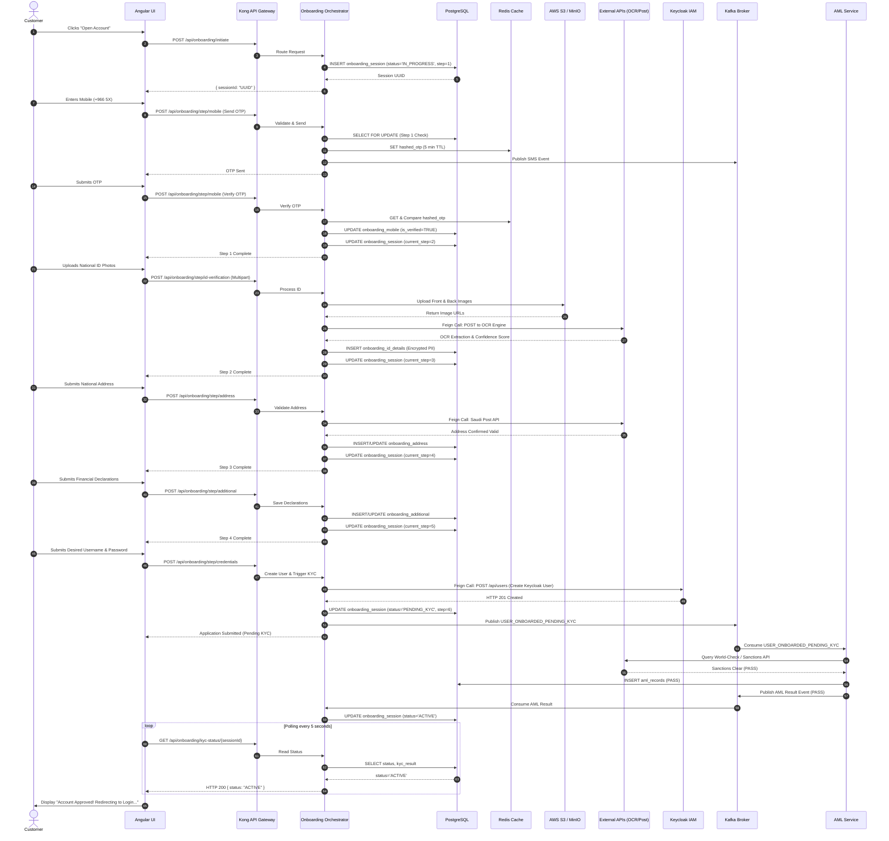

Listed directory bankSaudiFransi
Viewed project_desc.md:1-157
Viewed projectflow.md:1-29
Viewed which_service_doing_what.md:1-98
Viewed roll_back_transaction.md:1-117
Viewed api_results.md:1-242
Viewed db_details.md:1-232

# PHASE 0 — SOURCE INVENTORY

Before conducting any architectural analysis, the entire project workspace directory (`c:\Users\Rishabh\Music\bankSaudiFransi`) was inspected using filesystem tools. Exactly six Markdown files were discovered and read in their entirety (100% of bytes and lines). No executable source code files (`.java`, `.ts`, `.sql`), configuration manifests (`application.yml`, `Dockerfile`, Kubernetes manifests), or build files (`pom.xml`, `package.json`) exist in the workspace.

### Workspace File Inventory

| File | Available? | Content? | Purpose | Relevant Sections |
| :--- | :--- | :--- | :--- | :--- |
| [`api_results.md`](file:///c:/Users/Rishabh/Music/bankSaudiFransi/api_results.md) | **Yes** (242 lines, 10,507 bytes) | Complete | Documents REST API endpoints, business logic, SQL queries executed per endpoint, locking patterns, and query summary. | Endpoints 1–8, SQL queries, `SELECT ... FOR UPDATE` usage, Audit log insert query. |
| [`db_details.md`](file:///c:/Users/Rishabh/Music/bankSaudiFransi/db_details.md) | **Yes** (232 lines, 13,732 bytes) | Complete | Documents relational database schema (DDL), table constraints, indexes, encryption strategy, ERD relationships, archival strategy. | DDL for 6 tables, Partial unique indexes, Foreign keys, AES-256 PII encryption, cleanup cron SQL. |
| [`project_desc.md`](file:///c:/Users/Rishabh/Music/bankSaudiFransi/project_desc.md) | **Yes** (157 lines, 10,875 bytes) | Complete | High-level system overview, technology stack choices, Spring State Machine definition, Angular frontend architecture, end-to-end user journey. | Tech stack, Hexagonal architecture, Spring State Machine states/events, Angular UI Stepper, Security considerations. |
| [`projectflow.md`](file:///c:/Users/Rishabh/Music/bankSaudiFransi/projectflow.md) | **Yes** (29 lines, 3,473 bytes) | Complete | ASCII architectural diagram showing customer-facing channels, internal systems, the BSF ID Verification Hub, and Government ID Registry. | 8 Enterprise Use Cases, Central Identity Hub gateway routing, Government ID sync (Yakeen/Absher). |
| [`roll_back_transaction.md`](file:///c:/Users/Rishabh/Music/bankSaudiFransi/roll_back_transaction.md) | **Yes** (117 lines, 7,861 bytes) | Complete | Detailed failure handling, local vs distributed rollback, Saga compensating transactions, IAM compensation, cron cleanup. | Embedded orchestrator rationale, Scenarios A through E, Golden Rule of DB-first, compensating REST calls. |
| [`which_service_doing_what.md`](file:///c:/Users/Rishabh/Music/bankSaudiFransi/which_service_doing_what.md) | **Yes** (98 lines, 10,144 bytes) | Complete | Microservices decomposition diagram, per-service responsibilities, databases, sync/async communications, external APIs, and rollback strategies. | 6 Microservices breakdown table, Kong API gateway, Feign clients vs Kafka, Database-per-service mapping. |

---

## SOURCE COVERAGE

### 1. Documents Successfully Read
All six documents ([`project_desc.md`](file:///c:/Users/Rishabh/Music/bankSaudiFransi/project_desc.md), [`projectflow.md`](file:///c:/Users/Rishabh/Music/bankSaudiFransi/projectflow.md), [`which_service_doing_what.md`](file:///c:/Users/Rishabh/Music/bankSaudiFransi/which_service_doing_what.md), [`roll_back_transaction.md`](file:///c:/Users/Rishabh/Music/bankSaudiFransi/roll_back_transaction.md), [`api_results.md`](file:///c:/Users/Rishabh/Music/bankSaudiFransi/api_results.md), [`db_details.md`](file:///c:/Users/Rishabh/Music/bankSaudiFransi/db_details.md)) were successfully ingested and analyzed line-by-line.

### 2. Useful Information Covered in Documents
- Functional flow of a 6-step customer onboarding wizard (Session initiation, Mobile verification, ID OCR verification, Address validation, Additional income info, IAM credentials creation, and background AML/KYC check).
- PostgreSQL DDL specifications for onboarding session, mobile, identity, address, additional details, and audit log tables.
- SQL query statements for all user-facing REST API endpoints.
- Integration points: Redis for OTP, AWS S3 for identity images, Kong as API gateway, Keycloak for IAM, Kafka for background processing, and third-party APIs (Saudi Post, OCR, World-Check/Refinitiv, Twilio/SMS gateway, Yakeen/Absher).
- Compensation workflows for IAM user creation failure and AML rejection.

### 3. Critical Gaps and Missing Areas
- **Source Code Verification**: No Java Spring Boot code, repository classes, Feign client interfaces, or Angular TypeScript components exist in the workspace. All implementation behavior must be extracted strictly from documentation snippets.
- **Kafka Topology**: Kafka topic names (except `USER_ONBOARDED_PENDING_KYC`), partition counts, replication factors, partition keys, consumer group names, offset commit semantics, and Dead Letter Queue (DLQ) configs are completely absent ([UNKNOWN]).
- **Network & Infrastructure**: Subnets, mTLS, VPC peering, Kubernetes Helm charts, and service meshes are absent ([UNKNOWN]).
- **Key Management**: Exact KMS/Vault encryption/decryption key rotation lifecycle is absent ([UNKNOWN]).

### 4. Direct Document Contradictions Identified
- **Service Topology Conflict**: [`project_desc.md`](file:///c:/Users/Rishabh/Music/bankSaudiFransi/project_desc.md) (lines 1, 57-65) and [`roll_back_transaction.md`](file:///c:/Users/Rishabh/Music/bankSaudiFransi/roll_back_transaction.md) (lines 7-12) explicitly state that the system is a **single standalone microservice** (`onboarding-service`) with an embedded Spring State Machine orchestrator managing a single PostgreSQL database containing all tables. In contrast, [`which_service_doing_what.md`](file:///c:/Users/Rishabh/Music/bankSaudiFransi/which_service_doing_what.md) (lines 8-49, 55-63) details a **6-microservice distributed architecture** following the Database-per-Service pattern (`onboarding_db`, `identity_db`, `address_db`, `notification_logs`, Keycloak `user_store`, `aml_db`).
- **PostgreSQL DDL Bug**: [`db_details.md`](file:///c:/Users/Rishabh/Music/bankSaudiFransi/db_details.md) (line 89) specifies a partial unique index: `WHERE created_at > NOW() - INTERVAL '90 days'`. In PostgreSQL, index predicates **cannot** contain volatile functions like `NOW()`. This will fail syntax/DDL validation at database creation time.
- **Locking Terminology Error**: [`api_results.md`](file:///c:/Users/Rishabh/Music/bankSaudiFransi/api_results.md) (lines 39-40, 79-80) labels `SELECT ... FOR UPDATE` as an "Optimistic Lock check". In database systems, `SELECT ... FOR UPDATE` is strictly **Pessimistic Locking**.

---

# PHASE 0 — PROJECT BIBLE

### 1. Business Objective
[FACT] Enable retail banking prospects to open an account with Bank Saudi Fransi (BSF) digitally via a self-service web/mobile channel, satisfying Saudi Central Bank (SAMA) compliance mandates without requiring an in-branch physical visit.

### 2. Customer Journey
[FACT] The prospect begins on the landing page, creates a session, verifies their Saudi mobile number via OTP, uploads their National ID/Iqama for OCR extraction, confirms their National Address via Saudi Post integration, submits financial/employment declarations, sets online banking credentials in IAM (Keycloak), and awaits automated AML/sanctions screening.

### 3. Actors
- **Prospect / Customer**: [FACT] End-user interacting via Angular web client.
- **Branch CRM / Teller**: [FACT] Internal operator performing walk-in scanning ([`projectflow.md`](file:///c:/Users/Rishabh/Music/bankSaudiFransi/projectflow.md)).
- **Call Center IVR Agent**: [FACT] Authenticating customer over phone ([`projectflow.md`](file:///c:/Users/Rishabh/Music/bankSaudiFransi/projectflow.md)).
- **Compliance Officer**: [INFERENCE] Reviews flagged AML cases (`MANUAL_REVIEW`).
- **Batch Scheduler**: [FACT] Nightly cron jobs for cleanup and re-KYC.

### 4. Frontend
[FACT] Angular 16+ application using Standalone Components, Angular Material Stepper hosted in `OnboardingContainerComponent`, RxJS `BehaviorSubject` / NgRx Component Store (`OnboardingStateService`), Angular HTTP Interceptors appending `sessionId`, and Route Guards (`OnboardingGuard`).

### 5. API Gateway
[FACT] Kong API Gateway routing HTTPS/REST traffic from the Angular UI to the backend onboarding services ([`which_service_doing_what.md`](file:///c:/Users/Rishabh/Music/bankSaudiFransi/which_service_doing_what.md)). In [`projectflow.md`](file:///c:/Users/Rishabh/Music/bankSaudiFransi/projectflow.md), the "BSF ID Verification Microservice" acts as the central security and compliance hub.

### 6. Backend Services
- [CONFLICT] **Model 1 (Single Dedicated Service)**: `onboarding-service` built with Java Spring Boot, Hexagonal/Onion architecture, containing an embedded Spring State Machine orchestrator ([`project_desc.md`](file:///c:/Users/Rishabh/Music/bankSaudiFransi/project_desc.md), [`roll_back_transaction.md`](file:///c:/Users/Rishabh/Music/bankSaudiFransi/roll_back_transaction.md)).
- [CONFLICT] **Model 2 (Distributed Microservices)**: 6 discrete services ([`which_service_doing_what.md`](file:///c:/Users/Rishabh/Music/bankSaudiFransi/which_service_doing_what.md)):
  1. Onboarding Orchestrator Service
  2. Identity Verification Service
  3. Address Validation Service
  4. Notification Service
  5. IAM / Credential Service
  6. AML Background Service

### 7. Databases
- **Primary Operational DB**: [FACT] PostgreSQL (holds `onboarding_session`, `onboarding_mobile`, `onboarding_id_details`, `onboarding_address`, `onboarding_additional`, `audit_log`).
- [CONFLICT] Under Model 2: Separate databases exist per service (`onboarding_db`, `identity_db`, `address_db`, `notification_logs` in MongoDB/PSQL, Keycloak PostgreSQL `user_store`, `aml_db`).

### 8. External Systems
- **Government ID Registry**: [FACT] Yakeen / Absher ([`projectflow.md`](file:///c:/Users/Rishabh/Music/bankSaudiFransi/projectflow.md)).
- **OCR Engine**: [FACT] Third-party OCR service for optical extraction and confidence scoring.
- **Address Validation**: [FACT] Saudi Post / National Address API.
- **SMS / Email Gateways**: [FACT] Twilio / SMS Gateway API and SendGrid / Email API.
- **Sanctions & Screening**: [FACT] World-Check / Refinitiv / Government Sanctions List API.

### 9. Cache
[FACT] Redis used for:
- 5-minute TTL storage of hashed mobile OTPs.
- Address caching for city/district lookups in Address Service ([`which_service_doing_what.md`](file:///c:/Users/Rishabh/Music/bankSaudiFransi/which_service_doing_what.md)).

### 10. Object Storage
[FACT] AWS S3 or MinIO used for storing front and back ID document image binary files, referenced in PostgreSQL via path/URL columns.

### 11. Messaging Infrastructure
[FACT] Apache Kafka (or RabbitMQ per [`project_desc.md`](file:///c:/Users/Rishabh/Music/bankSaudiFransi/project_desc.md) line 134) used for asynchronous event publishing:
- Orchestrator to Notification Service (OTP/SMS and welcome emails).
- Orchestrator to AML Service (`USER_ONBOARDED_PENDING_KYC`).
- AML Service to Orchestrator (AML evaluation result).

### 12. IAM (Identity and Access Management)
[FACT] Keycloak / Internal IAM service exposing REST APIs for user credential creation (`POST /api/users`), user deletion compensation (`DELETE /api/users/{username}`), and account disabling (`PUT /api/users/{username}/disable`).

### 13. OCR
[FACT] Optical Character Recognition API called synchronously via Spring Cloud OpenFeign to parse ID card images, extracting full name, date of birth, expiry date, and returning an `ocr_score` (0.00 to 100.00).

### 14. Address Verification
[FACT] National Address API (Saudi Post) called synchronously via Feign client to validate building number, postal code, district, and city.

### 15. KYC (Know Your Customer)
[FACT] Customer due diligence executed through identity image verification, national ID duplicate checks (90-day window), and employment/income declarations.

### 16. AML (Anti-Money Laundering)
[FACT] Background screening service querying World-Check/Refinitiv and government sanctions lists for PEP (Politically Exposed Persons) and blacklisted entities.

### 17. Notification
[FACT] Asynchronous service consuming Kafka messages to dispatch SMS OTP codes and status emails via Twilio and SendGrid.

### 18. Service-to-Service Communication
- **Synchronous**: [FACT] REST / JSON over HTTP/HTTPS using Spring Cloud OpenFeign for Steps 1–5 (Orchestrator to Identity, Address, and IAM services).
- **Asynchronous**: [FACT] Event-driven via Kafka topics for Notification dispatch and background AML processing.

### Comprehensive Component Inventory Table

| Component | Responsibility | Data Owned | Dependencies | Communication | Source |
| :--- | :--- | :--- | :--- | :--- | :--- |
| **Angular UI** | Client-side 6-step form wizard, file compression, state caching | Local session state, Stepper index | API Gateway (Kong) | HTTPS / REST | [`project_desc.md`](file:///c:/Users/Rishabh/Music/bankSaudiFransi/project_desc.md) |
| **Kong API Gateway** | TLS termination, rate limiting, request routing | Routing tables, rate-limit counters | Backend microservices | HTTPS / REST | [`which_service_doing_what.md`](file:///c:/Users/Rishabh/Music/bankSaudiFransi/which_service_doing_what.md) |
| **Onboarding Orchestrator** | Enforces State Machine, coordinates steps, initiates compensation | `onboarding_session`, step tables | Identity, Address, IAM, Kafka | REST (Feign) / Kafka | [`project_desc.md`](file:///c:/Users/Rishabh/Music/bankSaudiFransi/project_desc.md), [`which_service_doing_what.md`](file:///c:/Users/Rishabh/Music/bankSaudiFransi/which_service_doing_what.md) |
| **Identity Service** | ID validation, OCR trigger, duplicate detection, PII encryption | `onboarding_id_details` / `identity_db` | OCR API, AWS S3 | Feign (Sync) | [`which_service_doing_what.md`](file:///c:/Users/Rishabh/Music/bankSaudiFransi/which_service_doing_what.md), [`api_results.md`](file:///c:/Users/Rishabh/Music/bankSaudiFransi/api_results.md) |
| **Address Service** | Validates Saudi National Address, manages address cache | `onboarding_address` / `address_db`, Redis | Saudi Post API | Feign (Sync) | [`which_service_doing_what.md`](file:///c:/Users/Rishabh/Music/bankSaudiFransi/which_service_doing_what.md) |
| **Notification Service** | Sends SMS OTP and lifecycle emails | `notification_logs` (MongoDB/PSQL) | Twilio, SendGrid | Kafka Consumer (Async) | [`which_service_doing_what.md`](file:///c:/Users/Rishabh/Music/bankSaudiFransi/which_service_doing_what.md) |
| **IAM Service (Keycloak)** | User credential management, authentication store | Keycloak `user_store` | None (Internal) | Feign (Sync) / Kafka (Async) | [`which_service_doing_what.md`](file:///c:/Users/Rishabh/Music/bankSaudiFransi/which_service_doing_what.md), [`roll_back_transaction.md`](file:///c:/Users/Rishabh/Music/bankSaudiFransi/roll_back_transaction.md) |
| **AML Service** | Sanctions, blacklist, and PEP screening | `aml_db` (`aml_records`) | World-Check / Sanctions API | Kafka Consumer/Producer | [`which_service_doing_what.md`](file:///c:/Users/Rishabh/Music/bankSaudiFransi/which_service_doing_what.md) |
| **Redis** | Temporary OTP cache (5 min TTL), address cache | Hashed OTPs, cached cities/districts | Onboarding / Address Service | In-memory TCP | [`project_desc.md`](file:///c:/Users/Rishabh/Music/bankSaudiFransi/project_desc.md), [`which_service_doing_what.md`](file:///c:/Users/Rishabh/Music/bankSaudiFransi/which_service_doing_what.md) |
| **AWS S3 / MinIO** | Unstructured binary storage for ID images | Front & Back ID image files | Onboarding / Identity Service | HTTPS REST SDK | [`project_desc.md`](file:///c:/Users/Rishabh/Music/bankSaudiFransi/project_desc.md), [`db_details.md`](file:///c:/Users/Rishabh/Music/bankSaudiFransi/db_details.md) |
| **PostgreSQL** | ACID relational storage for sessions and audit | Onboarding schema & partitioned audit | All core services | JDBC / HikariCP | [`db_details.md`](file:///c:/Users/Rishabh/Music/bankSaudiFransi/db_details.md) |

---

# PHASE 1 — BUSINESS WORKFLOW

### Step-by-Step Customer Onboarding Journey

#### STEP 0: Session Initiation
- **Customer action**: Clicks "Continue" or "Open Account" on the landing page.
- **API**: `POST /api/onboarding/initiate`
- **Service**: Onboarding Orchestrator Service.
- **Database**: `onboarding_session` (PostgreSQL).
- **External service**: None.
- **Synchronous / asynchronous**: Synchronous.
- **Validation**: User-Agent and client IP extracted.
- **State before**: None (unauthenticated, non-existent session).
- **State after**: `INITIATED` (status: `IN_PROGRESS`, `current_step`: 1).
- **Success behavior**: Returns HTTP 201/200 with `{ sessionId: "UUID" }`. Angular stores `sessionId` in `localStorage`.
- **Failure behavior**: HTTP 500 error toast returned; user remains on landing page.
- **Retry behavior**: Customer re-clicks "Continue", generating a new UUID.
- **Compensation**: None.
- **Audit behavior**: [FACT] Asynchronous insert into `audit_log` (`event_type = 'API_CALL'`).

#### STEP 1: Mobile Submission & OTP Verification
- **Customer action**: Enters Saudi mobile number (+966 5XXXXXXXX) and enters received 4/6-digit SMS OTP.
- **API**: `POST /api/onboarding/step/mobile` (Sub-actions: Send OTP, Verify OTP).
- **Service**: Onboarding Orchestrator Service.
- **Database**: `onboarding_mobile`, `onboarding_session` (PostgreSQL), Redis.
- **External service**: SMS Gateway (Twilio) via Notification Service.
- **Synchronous / asynchronous**: Synchronous for HTTP request/response; Kafka async for SMS dispatch ([`which_service_doing_what.md`](file:///c:/Users/Rishabh/Music/bankSaudiFransi/which_service_doing_what.md)).
- **Validation**: Saudi mobile regex validation; 90-day duplicate mobile check via `mobile_hash`.
- **State before**: `INITIATED` (`current_step`: 1).
- **State after**: `MOBILE_VERIFIED` (`current_step`: 2).
- **Success behavior**: OTP validated against Redis hash; `is_verified` set to `TRUE`; stepper advances to Step 2.
- **Failure behavior**: Invalid OTP increments `retry_count`. If `retry_count >= 5`, locked out.
- **Retry behavior**: Client can request OTP resend after countdown timer expires.
- **Compensation**: None needed; Redis OTP naturally expires after 5 minutes TTL.
- **Audit behavior**: `audit_log` record inserted (`STEP1_OTP_SENT`, `STEP1_OTP_VERIFIED`).

#### STEP 2: Identity Upload & OCR Verification
- **Customer action**: Uploads front and back images of National ID / Iqama and submits ID number.
- **API**: `POST /api/onboarding/step/id-verification` (Multipart/form-data).
- **Service**: Identity Verification Service (or Onboarding Service).
- **Database**: `onboarding_id_details`, `onboarding_session` (PostgreSQL), AWS S3.
- **External service**: Third-party OCR API, AWS S3 / MinIO.
- **Synchronous / asynchronous**: Synchronous REST to OCR via Feign client.
- **Validation**: Client compresses images < 5MB; 90-day duplicate national ID check (`national_id_hash`); OCR confidence threshold (`ocr_score`).
- **State before**: `MOBILE_VERIFIED` (`current_step`: 2).
- **State after**: `ID_VERIFIED` (`current_step`: 3).
- **Success behavior**: Images stored in S3; PII encrypted with AES-256; `current_step` updated to 3.
- **Failure behavior**: OCR failure or duplicate ID throws exception; `@Transactional` triggers DB rollback; returns HTTP 400/422.
- **Retry behavior**: User re-uploads clearer photos.
- **Compensation**: [FACT] Local DB rollback. [UNKNOWN] S3 uploaded image deletion logic is not documented.
- **Audit behavior**: Logged to `audit_log` with OCR status and score.

#### STEP 3: National Address Validation
- **Customer action**: Enters building number, street, postal code, district, and city (or selects via auto-suggest).
- **API**: `POST /api/onboarding/step/address`
- **Service**: Address Validation Service (or Onboarding Service).
- **Database**: `onboarding_address`, `onboarding_session` (PostgreSQL), Redis (`address_cache`).
- **External service**: Saudi Post / National Address API.
- **Synchronous / asynchronous**: Synchronous via Feign client.
- **Validation**: Address validated against government registry.
- **State before**: `ID_VERIFIED` (`current_step`: 3).
- **State after**: `ADDRESS_VERIFIED` (`current_step`: 4).
- **Success behavior**: Address persisted with `is_national_address = TRUE`; `current_step` set to 4.
- **Failure behavior**: API timeout (>3s) or invalid address rolls back local DB update; user remains on Step 3.
- **Retry behavior**: User corrects building/postal details and resubmits.
- **Compensation**: Local DB rollback.
- **Audit behavior**: Insert into `audit_log`.

#### STEP 4: Additional Information & Declarations
- **Customer action**: Selects employment status, employer name, annual income range, source of funds, and existing BSF account flag.
- **API**: `POST /api/onboarding/step/additional`
- **Service**: Onboarding Orchestrator Service.
- **Database**: `onboarding_additional`, `onboarding_session` (PostgreSQL).
- **External service**: None.
- **Synchronous / asynchronous**: Synchronous.
- **Validation**: Income >= 0, valid enum check on employment status (`EMPLOYED`, `SELF_EMPLOYED`, etc.).
- **State before**: `ADDRESS_VERIFIED` (`current_step`: 4).
- **State after**: `INFO_SUBMITTED` (`current_step`: 5).
- **Success behavior**: Upserts `onboarding_additional`; sets `current_step = 5`.
- **Failure behavior**: Validation error returns HTTP 400; DB transaction rolls back.
- **Retry behavior**: User adjusts fields and clicks "Next".
- **Compensation**: Local DB rollback.
- **Audit behavior**: Insert into `audit_log`.

#### STEP 5: Credentials Creation & KYC Initiation
- **Customer action**: Enters desired online banking username and password.
- **API**: `POST /api/onboarding/step/credentials`
- **Service**: IAM / Credential Service & Onboarding Orchestrator.
- **Database**: Keycloak `user_store`, `onboarding_session` (PostgreSQL).
- **External service**: Keycloak IAM REST API, Kafka messaging broker.
- **Synchronous / asynchronous**: Synchronous Feign call to Keycloak; Asynchronous Kafka publish for background AML.
- **Validation**: Password complexity checked; username uniqueness verified.
- **State before**: `INFO_SUBMITTED` (`current_step`: 5).
- **State after**: `PENDING_KYC` (`current_step`: 6, status: `'PENDING_KYC'`).
- **Success behavior**: User created in Keycloak; DB consolidated data extracted; Kafka event `USER_ONBOARDED_PENDING_KYC` emitted; HTTP 200 returned.
- **Failure behavior**: If Keycloak fails, returns HTTP 500. If DB update fails after Keycloak succeeds, compensating action calls `DELETE /api/users/{username}` on Keycloak.
- **Retry behavior**: User re-enters credentials after fixing conflicts.
- **Compensation**: [FACT] Compensating REST call `DELETE /api/users/{username}` executed against Keycloak.
- **Audit behavior**: Insert into `audit_log`.

#### STEP 6: Asynchronous AML/Sanctions Background Verification
- **Customer action**: Awaits approval (Angular UI displays a verification spinner and polls `/kyc-status/{sessionId}`).
- **API**: `GET /api/onboarding/kyc-status/{sessionId}` (polling every 5s).
- **Service**: AML Background Service & Onboarding Orchestrator.
- **Database**: `aml_db` (`aml_records`), `onboarding_session` (PostgreSQL).
- **External service**: World-Check / Refinitiv / Sanctions List API.
- **Synchronous / asynchronous**: Fully asynchronous via Kafka event consumption.
- **Validation**: Name and National ID screened against global sanctions, PEP lists, and criminal registries.
- **State before**: `PENDING_KYC` (`status = 'PENDING_KYC'`).
- **State after**: `ACTIVE` (if PASS) or `REJECTED` (if FAIL).
- **Success behavior**: AML Service writes result `PASS` to `aml_db`; emits Kafka event to Orchestrator; Orchestrator updates `status = 'ACTIVE'`; user redirected to login.
- **Failure behavior**: AML matches blacklist; emits `REJECTED`; Orchestrator updates `status = 'REJECTED'`; calls Keycloak `PUT /api/users/{username}/disable` to block login; sends rejection email.
- **Retry behavior**: None (terminal compliance state); manual compliance review required if marked `MANUAL_REVIEW`.
- **Compensation**: [FACT] Orchestrator calls IAM service to disable/lock or delete the user credentials.
- **Audit behavior**: AML result and final account activation/rejection logged to `audit_log`.

---

### End-to-End Sequence Diagram



---

# PHASE 2 — SERVICE RESPONSIBILITY

### Service Responsibility Matrix

| Service | Owns | Reads | Writes | Calls | Called By | Sync/Async |
| :--- | :--- | :--- | :--- | :--- | :--- | :--- |
| **Onboarding Orchestrator** | Onboarding session state, Step advancement | `onboarding_session`, step child tables | `onboarding_session`, step child tables | Identity, Address, IAM, Kafka | Kong API Gateway | Inbound: Sync REST<br>Outbound: Sync & Async |
| **Identity Verification** | ID verification logic, OCR scoring, PII encryption | `identity_db` (`id_details`) | `identity_db` (`id_details`) | OCR API, S3 | Orchestrator | Sync (REST / Feign) |
| **Address Validation** | Saudi address parsing, address cache | `address_db`, Redis cache | `address_db`, Redis cache | Saudi Post API | Orchestrator | Sync (REST / Feign) |
| **Notification Service** | Dispatching SMS and emails, delivery tracking | Redis (OTP hash), `notification_logs` | `notification_logs` | Twilio, SendGrid | Kafka Broker | Async (Kafka Consumer) |
| **IAM / Credential Service** | User identity, password credentials, role mappings | Keycloak `user_store` | Keycloak `user_store` | None | Orchestrator | Sync (Create), Async (Disable) |
| **AML Background Service** | Sanctions screening, PEP validation, AML results | `aml_db` (`aml_records`) | `aml_db` (`aml_records`) | World-Check / Sanctions API | Kafka Broker | Async (Kafka Consumer/Producer) |

---

### Architectural Deconstruction: Service Boundaries

#### 1. Why is this a separate service?
- **Identity Verification Service**: [FACT] Isolates high-risk PII processing, heavy multipart image uploads, and CPU-intensive AES-256 encryption. [INFERENCE] Keeps bulky document uploads from exhausting memory buffers in the lightweight session orchestrator.
- **Address Validation Service**: [FACT] Encapsulates integrations with the external Saudi Post API and maintains its own Redis cache for Saudi cities and postal districts.
- **Notification Service**: [FACT] Decouples third-party telecommunication latency (Twilio, SMS gateways). If SMS gateways experience outages or 10-second carrier delays, the customer-facing onboarding APIs remain completely unaffected.
- **IAM / Credential Service (Keycloak)**: [FACT] Centralized enterprise authentication and authorization. It must exist independently to serve other banking channels (Mobile Banking, Internet Banking, Open Banking API Gateway) long after onboarding completes.
- **AML Background Service**: [FACT] Compliance checks against World-Check / Refinitiv can take anywhere from 30 seconds to several minutes depending on batch processing and manual escalations. Separating it prevents blocking synchronous HTTP threads.

#### 2. What would happen if these services were merged?
- **Merging Identity, Address, and Orchestrator into one single `onboarding-service`** (as documented in [`project_desc.md`](file:///c:/Users/Rishabh/Music/bankSaudiFransi/project_desc.md) and [`roll_back_transaction.md`](file:///c:/Users/Rishabh/Music/bankSaudiFransi/roll_back_transaction.md)):
  - *Pros*: Eliminates 3 internal network hops, removes distributed transaction complexities across Steps 1–4, allows local ACID transactions using `@Transactional`, simplifies CI/CD.
  - *Cons*: ID image upload spikes could consume JVM heap and impact session coordination; failure in the Saudi Post client dependency impacts the entire onboarding engine.
- **Merging AML Service into Orchestrator**:
  - *Catastrophic*: Long-running sanctions queries would exhaust backend worker threads, tie up database connection pools, and prevent high-throughput onboarding session creations.

#### 3. What would happen if this service were split further?
- Splitting `onboarding-service` into micro-services per step (e.g., `MobileStepService`, `AddressStepService`, `IncomeStepService`):
  - *Architectural Anti-pattern (Nano-services)*: Massive latency overhead (15+ network hops per onboarding session), distributed data management nightmare, extreme operational complexity without any business capability boundary justification.

---

# PHASE 3 — STATE MACHINE

### State Machine Definition

The system utilizes an embedded **Spring State Machine** to guard against out-of-order execution, bypass attacks, and invalid state changes ([`project_desc.md`](file:///c:/Users/Rishabh/Music/bankSaudiFransi/project_desc.md) lines 27-34).

#### States
- `INITIATED`: Master session record created; awaiting mobile submission.
- `MOBILE_VERIFIED`: Saudi mobile number confirmed via Redis OTP validation.
- `ID_VERIFIED`: ID document images processed by OCR, confidence verified, PII stored.
- `ADDRESS_VERIFIED`: National address validated against Saudi Post API.
- `INFO_SUBMITTED`: Employment and financial declarations persisted.
- `CREDENTIALS_CREATED`: Username and password successfully provisioned in Keycloak IAM.
- `KYC_PENDING`: Consolidated application published to Kafka for background AML screening.
- `ACTIVE`: Final background AML check passed; customer account unlocked.
- `REJECTED`: Final background AML check failed (sanctions match); customer account disabled.
- `EXPIRED`: [FACT] Documented in `onboarding_session` CHECK constraint (`status IN ('IN_PROGRESS', 'PENDING_KYC', 'ACTIVE', 'REJECTED', 'EXPIRED')`). Transitioned by daily archival batch job.

#### Events
- `VERIFY_MOBILE`: Triggers validation of SMS OTP.
- `VERIFY_ID`: Triggers OCR processing and ID image storage.
- `VERIFY_ADDRESS`: Triggers Saudi Post validation.
- `SUBMIT_INFO`: Triggers financial/employment persistence.
- `CREATE_CREDENTIALS`: Triggers Keycloak user provisioning and KYC queueing.
- `AML_PASS`: Asynchronous event indicating sanctions clear.
- `AML_REJECT`: Asynchronous event indicating sanctions hit.

---

### State Transition Flow

```
[INITIATED]
       │
       ▼  (Event: VERIFY_MOBILE | Guard: OTP match in Redis | Action: UPDATE current_step=2)
[MOBILE_VERIFIED]
       │
       ▼  (Event: VERIFY_ID | Guard: OCR score >= threshold & Not Duplicate | Action: UPDATE current_step=3)
[ID_VERIFIED]
       │
       ▼  (Event: VERIFY_ADDRESS | Guard: Saudi Post API Success | Action: UPDATE current_step=4)
[ADDRESS_VERIFIED]
       │
       ▼  (Event: SUBMIT_INFO | Guard: Valid Income & Employment enum | Action: UPDATE current_step=5)
[INFO_SUBMITTED]
       │
       ▼  (Event: CREATE_CREDENTIALS | Guard: Keycloak User Created | Action: UPDATE status='PENDING_KYC', step=6)
[KYC_PENDING]
       ├─────────────────────────────────────────┐
       ▼ (Event: AML_PASS)                       ▼ (Event: AML_REJECT)
    [ACTIVE]                                  [REJECTED]
       │                                         │
       ▼                                         ▼
(Account Ready)                           (IAM User Disabled)
```

---

### Transition Guards, Concurrency, and Edge Cases

- **What prevents invalid transitions?**: [FACT] Database queries enforce preconditions in the `WHERE` clause:
  - Advancing to Step 2 requires `WHERE id = ? AND current_step = 1`.
  - Advancing to Step 3 requires `WHERE id = ? AND current_step = 2`.
  - Moving to `PENDING_KYC` requires `WHERE id = ? AND status = 'IN_PROGRESS'`.
  If an attacker attempts to skip from Step 1 to Step 5, the `UPDATE` query affects 0 rows, and the service throws a 409 Conflict or 400 Bad Request error.
- **Duplicate Request Handling**: [FACT] Handled idempotently. If `POST /step/mobile` is submitted again for a session already on Step 2, the service queries `current_step` via `SELECT ... FOR UPDATE`, observes `current_step >= 2`, and returns HTTP 200 with the existing state without re-executing business logic.
- **Out-of-Order Requests**: [FACT] If the frontend sends Step 4 while the session is on Step 2, the State Machine guard rejects the event, preventing progression.
- **Timeout Handling**: [FACT] If an external API (OCR or Saudi Post) times out, the local database transaction rolls back, keeping `current_step` at its prior value. The state remains unchanged, allowing safe user retry.

---

# PHASE 4 — API DEEP DIVE

---

## 1. `POST /api/onboarding/initiate`

### Purpose
[FACT] Initiates a brand-new onboarding session for a prospective customer.

### Caller
[FACT] Angular UI (`OnboardingContainerComponent`) upon landing page CTA click.

### Endpoint
`POST /api/onboarding/initiate`

### Request
```json
{
  "idType": "NATIONAL"
}
```
*(Headers: `User-Agent`, `X-Forwarded-For` / client IP)*

### Response
```json
{
  "sessionId": "a0eebc99-9c0b-4ef8-bb6d-6bb9bd380a11",
  "currentStep": 1,
  "status": "IN_PROGRESS"
}
```

### Validation
- [FACT] `idType` must be one of `'NATIONAL'`, `'IQAMA'`, or `'VISITOR'` (enforced by DB check constraint).
- [FACT] Client IP address extracted and cast to PostgreSQL `INET` type.

### Service
[FACT] Onboarding Orchestrator Service.

### Database Operations
```sql
INSERT INTO onboarding_session (id, id_type, current_step, status, ip_address, user_agent, created_at, updated_at) 
VALUES (?, ?, 1, 'IN_PROGRESS', ?::inet, ?, NOW(), NOW());
```

### External Calls
None.

### Transaction Boundary
```
BEGIN
  --> INSERT INTO onboarding_session
COMMIT
```

### State Transition
`NONE` $\rightarrow$ `INITIATED` (`status = 'IN_PROGRESS'`, `current_step = 1`).

### Idempotency
Non-idempotent. Every call generates a distinct UUID session.

### Concurrency
No concurrency conflict possible; each invocation generates a cryptographically random UUID via `gen_random_uuid()` or application UUID generator.

### Failure Handling
Returns HTTP 500 if PostgreSQL connection pool is saturated or database is unavailable.

### Retry
Client can safely re-click "Continue", obtaining a fresh session UUID.

### Compensation
None required. Stale sessions cleaned up after 7 days by scheduled cron job.

### Audit
[FACT] Asynchronous background insert into `audit_log`:
```sql
INSERT INTO audit_log (session_id, event_type, payload, ip_address, user_agent, created_at)
VALUES (?, 'API_CALL', jsonb_build_object('endpoint', '/api/onboarding/initiate', ...), ?::inet, ?, NOW());
```

### Architect Questions
1. *Why generate the UUID on the application server rather than letting PostgreSQL generate it via `DEFAULT gen_random_uuid()`?* (Application-side generation eliminates a `RETURNING id` round-trip and allows constructing downstream entity keys before executing the SQL insert).
2. *How does storing the client IP as `INET` rather than `VARCHAR(45)` affect indexing and storage?* (PostgreSQL `INET` stores IPv4 in 7 bytes and IPv6 in 19 bytes, provides subnet math operators, and enforces strict IP format validation at the database engine level).
3. *What prevents a bot from flooding `/initiate` and filling the `onboarding_session` table with junk rows?* (Rate limiting at Kong API Gateway via Bucket4j / Redis token bucket per client IP; uncompleted sessions pruned after 7 days).
4. *Why is `external_reference_id` nullable and unique in `onboarding_session`?* (To permit optional correlation with external CRM or lead tracking systems while enforcing uniqueness only when populated).
5. *If `audit_log` insertion is asynchronous, what happens if the worker thread pool is exhausted?* (Task rejection policies must be configured—either discard logs, block caller, or write to local fallback queue to prevent OutOfMemoryError).

---

## 2. `POST /api/onboarding/step/mobile` (Send OTP & Verify OTP)

### Purpose
[FACT] Captures prospective customer's Saudi mobile number, generates and dispatches an SMS OTP, and validates the submitted OTP to advance the onboarding step.

### Caller
[FACT] Angular UI (`StepMobileComponent`).

### Endpoint
`POST /api/onboarding/step/mobile`

### Request (Send OTP)
```json
{
  "sessionId": "a0eebc99-9c0b-4ef8-bb6d-6bb9bd380a11",
  "countryCode": "+966",
  "mobileNumber": "551234567"
}
```

### Request (Verify OTP)
```json
{
  "sessionId": "a0eebc99-9c0b-4ef8-bb6d-6bb9bd380a11",
  "otp": "482910"
}
```

### Response
```json
{
  "sessionId": "a0eebc99-9c0b-4ef8-bb6d-6bb9bd380a11",
  "currentStep": 2,
  "isVerified": true
}
```

### Validation
- Saudi mobile number format regex.
- Duplicate mobile screening within last 90 days.
- OTP verification against Redis SHA-256 hash.

### Service
[FACT] Onboarding Orchestrator Service (interacts with Notification Service and Redis).

### Database Operations
**Send OTP:**
```sql
-- 1. Check for duplicates (Active or Pending within 90 days)
SELECT s.id, s.status 
FROM onboarding_session s
JOIN onboarding_mobile m ON m.session_id = s.id
WHERE m.mobile_hash = ? 
  AND (s.status = 'ACTIVE' OR s.status = 'PENDING_KYC')
  AND s.created_at > NOW() - INTERVAL '90 days';

-- 2. Lock session row (Pessimistic lock)
SELECT current_step, status FROM onboarding_session WHERE id = ? FOR UPDATE;

-- 3. Upsert mobile record
INSERT INTO onboarding_mobile (session_id, encrypted_mobile, mobile_hash, country_code, is_verified, retry_count)
VALUES (?, ?, ?, ?, FALSE, 0)
ON CONFLICT (session_id) 
DO UPDATE SET encrypted_mobile = EXCLUDED.encrypted_mobile, mobile_hash = EXCLUDED.mobile_hash;
```

**Verify OTP:**
```sql
-- 1. Update verification flag
UPDATE onboarding_mobile 
SET is_verified = TRUE, verified_at = NOW(), retry_count = retry_count + 1 
WHERE session_id = ?;

-- 2. Advance step to 2
UPDATE onboarding_session 
SET current_step = 2, updated_at = NOW() 
WHERE id = ? AND current_step = 1;
```

### External Calls
- **Redis**: Store hashed OTP with 5-minute TTL: `SET session:<id>:otp <hash> EX 300`.
- **Kafka**: Publish event to Notification Service to trigger Twilio SMS.

### Transaction Boundary
```
BEGIN
  --> SELECT duplicate mobile_hash
  --> SELECT FOR UPDATE onboarding_session
  --> INSERT/UPDATE onboarding_mobile
  --> Redis SET (outside DB tx)
  --> Kafka Publish (outside DB tx)
COMMIT
```

### State Transition
`INITIATED` $\rightarrow$ `MOBILE_VERIFIED` (`current_step` advances from 1 to 2).

### Idempotency
- Send OTP is idempotent with respect to session upsert (`ON CONFLICT (session_id)`).
- Verify OTP is idempotent: if `current_step` is already 2, returns 200 OK without error.

### Concurrency
[FACT] Row-level pessimistic locking (`SELECT ... FOR UPDATE`) on `onboarding_session` prevents concurrent conflicting state updates.

### Failure Handling
- Incorrect OTP increments `retry_count`. If `retry_count >= 5`, user is locked out.
- Redis failure triggers fallback exception; user is instructed to retry.

### Retry
Client-side countdown timer (60s) before allowing OTP resend.

### Compensation
None. Redis OTP keys expire automatically.

### Audit
Insert into `audit_log` with `event_type = 'STEP1_OTP_SENT'` or `'STEP1_OTP_VERIFIED'`.

### Architect Questions
1. *Why store `mobile_hash` in `onboarding_mobile` when `encrypted_mobile` is already present?* (Because deterministic AES-256 with random IV produces non-deterministic ciphertext, preventing SQL equality lookups for duplicate checks. SHA-256 `mobile_hash` provides a fixed-length lookup token).
2. *Why is OTP kept in Redis instead of a column in `onboarding_mobile`?* (Eliminates high-frequency database writes, prevents disk I/O churn for ephemeral data, and leverages Redis native TTL for automatic purging).
3. *What is the exact race condition prevented by `SELECT ... FOR UPDATE` on Step 1?* (Two concurrent browser tabs submitting different mobile numbers for the same session; the lock serializes execution).
4. *Why does [`api_results.md`](file:///c:/Users/Rishabh/Music/bankSaudiFransi/api_results.md) label `SELECT ... FOR UPDATE` as an "Optimistic Lock check"?* (It is a blatant technical terminology error in the project documentation; `SELECT ... FOR UPDATE` is strictly pessimistic concurrency control).
5. *What happens if Kafka is down when sending the OTP?* (The OTP is stored in Redis, but the SMS is never sent. The user waits 60s and retries; a dual-write transaction problem).

---

## 3. `POST /api/onboarding/step/id-verification`

### Purpose
[FACT] Accepts uploaded ID images (front and back) and ID number, verifies authenticity via OCR, validates duplicate application constraints, encrypts PII, and stores document metadata.

### Caller
[FACT] Angular UI (`StepIdVerificationComponent`).

### Endpoint
`POST /api/onboarding/step/id-verification` (Multipart form-data: `frontImage`, `backImage`, `nationalId`, `idType`).

### Request
Multipart form-data payload containing binary image files and plaintext ID metadata.

### Response
```json
{
  "sessionId": "a0eebc99-9c0b-4ef8-bb6d-6bb9bd380a11",
  "currentStep": 3,
  "isOcrVerified": true,
  "ocrScore": 98.50
}
```

### Validation
- Image file size compressed client-side to < 5MB.
- ID format validation.
- 90-day duplicate national ID check (`national_id_hash`).
- OCR confidence score check (`ocr_score BETWEEN 0 AND 100`).

### Service
[FACT] Identity Verification Service (or embedded in Onboarding Service).

### Database Operations
```sql
-- 1. Check duplicate ID within 90 days
SELECT 1 FROM onboarding_id_details 
WHERE national_id_hash = ? 
  AND created_at > NOW() - INTERVAL '90 days';

-- 2. Lock session row
SELECT current_step FROM onboarding_session WHERE id = ? FOR UPDATE;

-- 3. Insert ID details
INSERT INTO onboarding_id_details (
    session_id, encrypted_national_id, national_id_hash, encrypted_full_name, 
    full_name_hash, date_of_birth, id_expiry_date, nationality, 
    front_image_path, back_image_path, ocr_score, is_ocr_verified
) VALUES (?, ?, ?, ?, ?, ?, ?, ?, ?, ?, ?, TRUE);

-- 4. Move session to Step 3
UPDATE onboarding_session 
SET current_step = 3, updated_at = NOW() 
WHERE id = ? AND current_step = 2;
```

### External Calls
1. **AWS S3 / MinIO**: Stream image binaries to bucket, obtain object keys/paths.
2. **Third-party OCR API**: Send image URL/stream via Feign client to extract full name, DOB, and expiry date.

### Transaction Boundary
```
BEGIN
  --> SELECT duplicate national_id_hash
  --> SELECT FOR UPDATE onboarding_session
  --> INSERT INTO onboarding_id_details
  --> UPDATE onboarding_session (current_step = 3)
COMMIT
```
*(Note: S3 upload and OCR Feign calls occur either before or during the transaction boundary).*

### State Transition
`MOBILE_VERIFIED` $\rightarrow$ `ID_VERIFIED` (`current_step` advances from 2 to 3).

### Idempotency
If already on Step 3, returns existing verification status.

### Concurrency
`SELECT FOR UPDATE` on `onboarding_session` prevents multiple simultaneous uploads for the same session.

### Failure Handling
- If OCR fails or score is below threshold, exception is thrown.
- `@Transactional` rolls back the local database insert. No row is saved to `onboarding_id_details`.
- Returns HTTP 422 with message "Please upload a clearer image."

### Retry
User can capture and upload new photographs of their identity document.

### Compensation
[FACT] Database transaction rollback. [UNKNOWN] Cleanup of S3 image objects on failure is undocumented.

### Audit
Logged to `audit_log` with `event_type = 'STEP2_OCR_VERIFIED'` or `'STEP2_OCR_FAILED'`.

### Architect Questions
1. *What is the fatal bug in [`db_details.md`](file:///c:/Users/Rishabh/Music/bankSaudiFransi/db_details.md) line 89 regarding `idx_unique_national_id_recent`?* (PostgreSQL rejects index predicates containing volatile functions like `NOW()`. `WHERE created_at > NOW() - INTERVAL '90 days'` will fail DDL execution with `ERROR: functions in index predicate must be marked IMMUTABLE`).
2. *If the OCR API takes 8 seconds to respond, what happens to the database connection pool if the call is placed inside `@Transactional`?* (HikariCP connection pool starvation; holding a DB connection idle while waiting for an external HTTP socket will quickly exhaust the pool under load).
3. *Why store S3 paths instead of storing image BLOBs directly in PostgreSQL?* (Storing image BLOBs inflates table size, causes severe TOAST table bloat, slows down sequential scans, and degrades database backup/restore operations).
4. *How are `encrypted_national_id` and `encrypted_full_name` secured?* (Application-level AES-256 encryption in GCM mode using keys retrieved from HashiCorp Vault, stored as `IV:CIPHERTEXT`).
5. *What happens if the S3 upload succeeds but the database insert fails?* (An orphaned S3 object remains; a robust production architecture requires an S3 deletion compensation hook or an S3 lifecycle expiration policy on temporary upload prefixes).

---

## 4. `POST /api/onboarding/step/address`

### Purpose
[FACT] Validates prospective customer's Saudi National Address against government postal databases and persists the verified address structure.

### Caller
[FACT] Angular UI (`StepAddressComponent`).

### Endpoint
`POST /api/onboarding/step/address`

### Request
```json
{
  "sessionId": "a0eebc99-9c0b-4ef8-bb6d-6bb9bd380a11",
  "buildingNumber": "1234",
  "streetName": "King Fahd Road",
  "district": "Al Olaya",
  "city": "Riyadh",
  "postalCode": "12214",
  "additionalMarker": "Near Kingdom Tower"
}
```

### Response
```json
{
  "sessionId": "a0eebc99-9c0b-4ef8-bb6d-6bb9bd380a11",
  "currentStep": 4,
  "isNationalAddress": true
}
```

### Validation
- Non-null check on `city`.
- Building number and postal code format validation.
- External validation via Saudi Post API.

### Service
[FACT] Address Validation Service (or Onboarding Service).

### Database Operations
```sql
-- 1. Upsert address
INSERT INTO onboarding_address (
    session_id, building_number, street_name, district, city, postal_code, 
    additional_marker, is_national_address, validated_at
) VALUES (?, ?, ?, ?, ?, ?, ?, TRUE, NOW())
ON CONFLICT (session_id) 
DO UPDATE SET 
    building_number = EXCLUDED.building_number,
    city = EXCLUDED.city,
    postal_code = EXCLUDED.postal_code,
    validated_at = NOW();

-- 2. Advance step to 4
UPDATE onboarding_session 
SET current_step = 4, updated_at = NOW() 
WHERE id = ? AND current_step = 3;
```

### External Calls
**Saudi Post / National Address API**: Synchronous REST call via Feign client to confirm building and postal code validity.

### Transaction Boundary
```
BEGIN
  --> External Saudi Post API call (via Feign)
  --> INSERT ... ON CONFLICT INTO onboarding_address
  --> UPDATE onboarding_session (current_step = 4)
COMMIT
```

### State Transition
`ID_VERIFIED` $\rightarrow$ `ADDRESS_VERIFIED` (`current_step` advances from 3 to 4).

### Idempotency
`ON CONFLICT (session_id)` ensures repeated invocations update rather than duplicate records.

### Concurrency
Serialized by session ID; state check ensures session must be at `current_step = 3`.

### Failure Handling
If Saudi Post API times out (>3 seconds) or returns invalid address, the transaction is rolled back. `current_step` remains 3.

### Retry
User edits address fields and resubmits.

### Compensation
Local database rollback via `@Transactional`.

### Audit
Insert into `audit_log`.

### Architect Questions
1. *Why does `onboarding_address` use `session_id` as the Primary Key instead of a separate `id BIGSERIAL`?* (Because the relationship with `onboarding_session` is strictly 1-to-1; using `session_id` as both PK and FK eliminates an unnecessary synthetic index and enforces cardinality at the schema level).
2. *Why is `city` indexed with `CREATE INDEX idx_address_city ON onboarding_address (city)`?* (Supports regional analytics, SAMA regulatory reporting by demographic region, and geographic distribution queries).
3. *What is the caching strategy for the Address Validation Service?* (Redis caches validated city, district, and postal code combinations to avoid repeated calls to the external Saudi Post API for common addresses).
4. *How does the system handle an address where the building number cannot be validated by Saudi Post?* (The external call returns an error/unvalidated status; transaction rolls back; UI prompts user to check their National Address credentials).
5. *Why is calling the external Saudi Post API inside `@Transactional` dangerous?* (It violates the rule of keeping database transactions short; if Saudi Post experiences latency spikes, DB connections remain locked, causing thread and connection pool exhaustion).

---

## 5. `POST /api/onboarding/step/additional`

### Purpose
[FACT] Captures employment status, employer name, annual income, source of funds, and existing BSF account declarations for KYC/AML compliance.

### Caller
[FACT] Angular UI (`StepAdditionalComponent`).

### Endpoint
`POST /api/onboarding/step/additional`

### Request
```json
{
  "sessionId": "a0eebc99-9c0b-4ef8-bb6d-6bb9bd380a11",
  "employmentStatus": "EMPLOYED",
  "employerName": "Saudi Aramco",
  "annualIncome": 180000.00,
  "sourceOfFunds": "SALARY",
  "hasPreviousBsfAccount": false
}
```

### Response
```json
{
  "sessionId": "a0eebc99-9c0b-4ef8-bb6d-6bb9bd380a11",
  "currentStep": 5
}
```

### Validation
- `employmentStatus` validated against check constraint: `IN ('EMPLOYED', 'SELF_EMPLOYED', 'STUDENT', 'RETIRED', 'UNEMPLOYED')`.
- `annualIncome >= 0`.

### Service
[FACT] Onboarding Orchestrator Service.

### Database Operations
```sql
-- 1. Upsert additional info
INSERT INTO onboarding_additional (
    session_id, employment_status, employer_name, annual_income, 
    source_of_funds, has_previous_bsf_account
) VALUES (?, ?, ?, ?, ?, ?)
ON CONFLICT (session_id) 
DO UPDATE SET 
    employment_status = EXCLUDED.employment_status,
    annual_income = EXCLUDED.annual_income;

-- 2. Advance step to 5
UPDATE onboarding_session 
SET current_step = 5, updated_at = NOW() 
WHERE id = ? AND current_step = 4;
```

### External Calls
None.

### Transaction Boundary
```
BEGIN
  --> INSERT ... ON CONFLICT INTO onboarding_additional
  --> UPDATE onboarding_session (current_step = 5)
COMMIT
```

### State Transition
`ADDRESS_VERIFIED` $\rightarrow$ `INFO_SUBMITTED` (`current_step` advances from 4 to 5).

### Idempotency
Idempotent upsert via `ON CONFLICT (session_id)`.

### Concurrency
Protected by `WHERE current_step = 4` guard.

### Failure Handling
Constraint violation returns HTTP 400. Transaction rolls back.

### Retry
User corrects inputs and resubmits.

### Compensation
Local database rollback.

### Audit
Logged to `audit_log`.

### Architect Questions
1. *Why is `annual_income` typed as `NUMERIC(15,2)` instead of `FLOAT` or `DOUBLE`?* (Financial applications strictly forbid floating-point types due to IEEE 754 binary representation rounding errors; `NUMERIC`/`DECIMAL` guarantees exact fixed-point arithmetic).
2. *Why is `onboarding_additional` modeled as a 1-to-0..1 table rather than columns inside `onboarding_session`?* (Normalization: keeps `onboarding_session` narrow and focused strictly on workflow state; keeps optional post-verification fields in a dedicated table).
3. *What is the business purpose of `has_previous_bsf_account`?* (Flags existing customer profiles to trigger deduplication or linkage with Core Banking systems).
4. *Can a user skip this step?* ([FACT] [`api_results.md`](file:///c:/Users/Rishabh/Music/bankSaudiFransi/api_results.md) line 126 states this step is optional in terms of routing if the user logs out, but mandatory to complete before advancing to credentials).
5. *Why is there no index on `employment_status` or `annual_income`?* (Low selectivity; these fields are accessed strictly via `session_id` PK during onboarding and never queried independently in high-throughput OLTP paths).

---

## 6. `POST /api/onboarding/step/credentials`

### Purpose
[FACT] Provisions user login credentials in Keycloak IAM, transitions session status to `PENDING_KYC`, consolidates onboarding data across all tables, and publishes an event to Kafka for background AML screening.

### Caller
[FACT] Angular UI (`StepCredentialsComponent`).

### Endpoint
`POST /api/onboarding/step/credentials`

### Request
```json
{
  "sessionId": "a0eebc99-9c0b-4ef8-bb6d-6bb9bd380a11",
  "username": "bsf_user_99",
  "password": "SecurePassword123!"
}
```

### Response
```json
{
  "sessionId": "a0eebc99-9c0b-4ef8-bb6d-6bb9bd380a11",
  "status": "PENDING_KYC",
  "message": "Credentials created successfully. KYC verification underway."
}
```

### Validation
- Password strength criteria (length, character classes).
- Session must be in `status = 'IN_PROGRESS'` and `current_step = 5`.

### Service
[FACT] IAM / Credential Service and Onboarding Orchestrator Service.

### Database Operations
```sql
-- 1. Fetch consolidated data across 5 tables
SELECT 
    s.id, s.id_type, m.encrypted_mobile, id.encrypted_national_id, 
    id.encrypted_full_name, id.date_of_birth, a.city, a.postal_code, 
    ad.employment_status, ad.annual_income
FROM onboarding_session s
LEFT JOIN onboarding_mobile m ON m.session_id = s.id
LEFT JOIN onboarding_id_details id ON id.session_id = s.id
LEFT JOIN onboarding_address a ON a.session_id = s.id
LEFT JOIN onboarding_additional ad ON ad.session_id = s.id
WHERE s.id = ?;

-- 2. Update session status to PENDING_KYC
UPDATE onboarding_session 
SET status = 'PENDING_KYC', current_step = 6, updated_at = NOW() 
WHERE id = ? AND status = 'IN_PROGRESS';
```

### External Calls
1. **Keycloak IAM**: Synchronous Feign REST call `POST /api/users` to create username and credentials.
2. **Kafka Broker**: Publish message `USER_ONBOARDED_PENDING_KYC` containing consolidated profile data.

### Transaction Boundary
```
BEGIN (Local DB)
  --> SELECT consolidated profile data (JOIN 5 tables)
  --> Keycloak POST /api/users (External REST Call)
  --> UPDATE onboarding_session (status = 'PENDING_KYC', current_step = 6)
COMMIT
  --> Kafka publish USER_ONBOARDED_PENDING_KYC
```

### State Transition
`INFO_SUBMITTED` $\rightarrow$ `CREDENTIALS_CREATED` $\rightarrow$ `KYC_PENDING` (`current_step = 6`, `status = 'PENDING_KYC'`).

### Idempotency
Non-idempotent on initial submission. Guarded by `WHERE id = ? AND status = 'IN_PROGRESS'`. If already `PENDING_KYC`, returns current status.

### Concurrency
`WHERE status = 'IN_PROGRESS'` prevents concurrent duplicate credential submissions.

### Failure Handling
- **If Keycloak creation fails**: HTTP 500 returned; DB transaction rolls back; session remains at Step 5.
- **If Keycloak succeeds but DB update fails**: [FACT] Compensating transaction triggers `DELETE /api/users/{username}` on Keycloak.
- **If Kafka publish fails**: [UNKNOWN] Dual-write gap in current implementation.

### Retry
If Keycloak username conflict occurs, user prompted to select a different username.

### Compensation
[FACT] Orchestrator catches database failure after successful Keycloak provisioning and immediately calls `DELETE /api/users/{username}` on Keycloak API.

### Audit
Logged to `audit_log` with `event_type = 'STEP6_CREDENTIALS_CREATED'`.

### Architect Questions
1. *What is the classic Dual-Write problem present in this endpoint?* (Database commits `PENDING_KYC`, but if the application crashes or Kafka broker is unreachable before `kafkaTemplate.send()`, the event is lost forever and the customer is stuck in `PENDING_KYC` indefinitely).
2. *Why does the orchestrator execute a compensating `DELETE` against Keycloak if the local database commit fails?* (Because Keycloak resides in a separate physical database (`user_store`); Spring's `@Transactional` cannot roll back changes in an external REST service).
3. *Why is the 5-table JOIN query executed before updating status?* (To gather the complete customer dossier required for the Kafka KYC payload while the read lock or consistent snapshot is valid).
4. *What happens if the compensating call `DELETE /api/users/{username}` fails due to a network timeout?* (An orphaned active user account remains in Keycloak; requires a dead-letter queue, outbox table, or periodic reconciliation batch job).
5. *Why is `current_step` updated to 6 when [`db_details.md`](file:///c:/Users/Rishabh/Music/bankSaudiFransi/db_details.md) only documents steps 1 through 5 tables?* (Step 6 represents the completed wizard state / pending KYC terminal phase).

---

## 7. `GET /api/onboarding/status/{sessionId}`

### Purpose
[FACT] Retrieves the current progress, state, and masked profile summary to restore the UI upon page refresh or browser restart.

### Caller
[FACT] Angular UI (`OnboardingGuard` and `OnboardingContainerComponent`).

### Endpoint
`GET /api/onboarding/status/{sessionId}`

### Request
Path parameter: `sessionId` (UUID).

### Response
```json
{
  "sessionId": "a0eebc99-9c0b-4ef8-bb6d-6bb9bd380a11",
  "currentStep": 3,
  "status": "IN_PROGRESS",
  "maskedMobile": "4567",
  "isVerified": true,
  "updatedAt": "2026-09-11T10:15:30Z"
}
```

### Validation
`sessionId` must be a valid UUID format.

### Service
[FACT] Onboarding Orchestrator Service.

### Database Operations
```sql
-- Query 1: Fetch session step and status
SELECT current_step, status, updated_at FROM onboarding_session WHERE id = ?;

-- Query 2: (Conditional if step >= 2) Fetch masked mobile
SELECT 
    RIGHT(encrypted_mobile, 4) as masked_mobile,
    is_verified
FROM onboarding_mobile WHERE session_id = ?;
```

### External Calls
None.

### Transaction Boundary
Read-only transaction (`@Transactional(readOnly = true)`).

### State Transition
None (pure read).

### Idempotency
Strictly idempotent.

### Concurrency
Safe read; hits primary key B-Tree index without taking locks.

### Failure Handling
If session UUID does not exist, returns HTTP 404 Not Found. Angular redirects to landing page.

### Retry
Client-side automatic retry on network disconnect.

### Compensation
None.

### Audit
Logged asynchronously to `audit_log`.

### Architect Questions
1. *Why does the backend return `RIGHT(encrypted_mobile, 4)` rather than decrypting the mobile number?* (PII protection: Decrypting full PII for UI restoration exposes sensitive data unnecessarily. Masking ensures zero exposure of cleartext PII across the browser transport layer).
2. *How does `OnboardingGuard` use this endpoint to prevent step skipping?* (If a user types `/onboarding/step-4` into their browser address bar, the guard fetches `currentStep`. If `currentStep < 4`, the router redirects them to their actual current step).
3. *What is the database indexing strategy that makes this query sub-millisecond?* (Direct lookup on `onboarding_session.id`, which is the B-Tree Primary Key).
4. *Why are there two separate queries instead of a single `LEFT JOIN`?* (Query 2 is conditional: executed only if `current_step >= 2`, avoiding unnecessary table joins for brand-new sessions).
5. *Could this endpoint be cached in Redis?* (Yes, session state can be cached with write-through invalidation on step advancement to offload read traffic from PostgreSQL).

---

## 8. `GET /api/onboarding/kyc-status/{sessionId}`

### Purpose
[FACT] Polling endpoint invoked by Angular UI while displaying the verification spinner to check the final AML/KYC evaluation outcome.

### Caller
[FACT] Angular UI (`StepCredentialsComponent` or final waiting screen).

### Endpoint
`GET /api/onboarding/kyc-status/{sessionId}`

### Request
Path parameter: `sessionId` (UUID).

### Response (In Progress)
HTTP 202 Accepted:
```json
{
  "sessionId": "a0eebc99-9c0b-4ef8-bb6d-6bb9bd380a11",
  "status": "PENDING_KYC"
}
```

### Response (Complete)
HTTP 200 OK:
```json
{
  "sessionId": "a0eebc99-9c0b-4ef8-bb6d-6bb9bd380a11",
  "status": "ACTIVE",
  "kycResult": "PASS"
}
```

### Validation
Valid UUID check.

### Service
[FACT] Onboarding Orchestrator Service.

### Database Operations
```sql
SELECT status, kyc_result FROM onboarding_session WHERE id = ?;
```

### External Calls
None.

### Transaction Boundary
Read-only transaction.

### State Transition
None (reads status updated asynchronously by the AML Kafka listener).

### Idempotency
Strictly idempotent.

### Concurrency
Safe concurrent read.

### Failure Handling
Returns HTTP 404 if session not found; returns HTTP 202 while background job runs.

### Retry
Angular polls every 5 seconds up to a timeout threshold (e.g., 2 minutes).

### Compensation
None.

### Audit
Logged to `audit_log`.

### Architect Questions
1. *Why use short-polling (every 5 seconds) instead of WebSockets or Server-Sent Events (SSE)?* (Simplicity, resilience over mobile network reconnections, statelessness across horizontal backend pods, and avoidance of persistent socket connection overhead on API gateways).
2. *What happens if the background AML check takes 15 minutes due to manual review?* (The frontend polling times out after a threshold; UI displays "Your application is under manual review. We will notify you via SMS/email when complete").
3. *How is `kyc_result` updated in PostgreSQL?* (The AML service processes the screening, publishes an event to Kafka; Orchestrator consumes the event and executes `UPDATE onboarding_session SET status='ACTIVE', kyc_result='PASS' WHERE id=?`).
4. *Why does this endpoint return HTTP 202 instead of 200 while pending?* (REST semantic compliance: HTTP 202 signifies that the request has been accepted for processing, but processing is not yet complete).
5. *Can high-frequency polling from thousands of concurrent users overload PostgreSQL?* (Yes. Polling directly against PostgreSQL creates read pressure; [RECOMMENDATION] Status should be read from Redis or cached via short TTL).

---

# PHASE 5 — DATABASE DEEP DIVE

```
+-------------------------------------------------------------------------------+
|                             onboarding_session                                |
|-------------------------------------------------------------------------------|
| id: UUID [PK]                                                                 |
| external_reference_id: VARCHAR(50) [UNIQUE]                                   |
| id_type: VARCHAR(20) [CHECK: 'NATIONAL','IQAMA','VISITOR']                    |
| current_step: SMALLINT [CHECK: 1..6]                                          |
| status: VARCHAR(30) [CHECK: 'IN_PROGRESS','PENDING_KYC','ACTIVE',...]         |
| kyc_result: VARCHAR(20) [CHECK: 'PASS','FAIL','MANUAL_REVIEW']                |
| ip_address: INET                                                              |
| user_agent: TEXT                                                              |
| created_at: TIMESTAMPTZ                                                       |
| updated_at: TIMESTAMPTZ                                                       |
+-------------------------------------------------------------------------------+
       | 1             | 1             | 1             | 1             | 1
       |               |               |               |               |
       | 1:1           | 1:1           | 1:1           | 1:0..1        | 1:N
       | CASCADE       | CASCADE       | CASCADE       | CASCADE       | SET NULL
       v               v               v               v               v
+--------------+ +---------------+ +--------------+ +---------------+ +-------------+
|onboarding_   | |onboarding_id_ | |onboarding_   | |onboarding_    | |audit_log    |
|mobile        | |details        | |address       | |additional     | |(Partitioned)|
|--------------| |---------------| |--------------| |---------------| |-------------|
|session_id[PK]| |session_id [PK]| |session_id[PK]| |session_id [PK]| |id:BIGSERIAL |
|encrypted_    | |encrypted_     | |building_no   | |employment_    | |session_id   |
|  mobile      | |  national_id  | |street_name   | |  status       | |event_type   |
|mobile_hash   | |national_id_   | |district      | |employer_name  | |payload:JSONB|
|  [UNIQUE]    | |  hash         | |city          | |annual_income  | |ip_address   |
|country_code  | |encrypted_name | |postal_code   | |source_of_funds| |user_agent   |
|is_verified   | |full_name_hash | |additional_   | |has_previous_  | |created_at   |
|verified_at   | |date_of_birth  | |  marker      | |  bsf_account  | +-------------+
|retry_count   | |id_expiry_date | |is_national_  | +---------------+
+--------------+ |nationality    | |  address     |
                 |front_image_path| |validated_at  |
                 |back_image_path| +--------------+
                 |ocr_score      |
                 |is_ocr_verified|
                 +---------------+
```

---

### Detailed Schema Analysis (Table-by-Table)

#### 1. Table: `onboarding_session`
- **Why it exists**: Master root entity holding the global state machine position and metadata for a user's onboarding lifecycle.
- **Business Concept**: Represents a single customer onboarding journey from landing page click to final account activation.
- **Primary Key**: `id UUID` (generated via `gen_random_uuid()`).
- **Foreign Keys**: None (Root aggregate).
- **Cardinality**: Root table; ~hundreds of thousands to millions of rows.
- **Constraints**:
  - `CHECK (id_type IN ('NATIONAL', 'IQAMA', 'VISITOR'))`
  - `CHECK (current_step BETWEEN 1 AND 6)`
  - `CHECK (status IN ('IN_PROGRESS', 'PENDING_KYC', 'ACTIVE', 'REJECTED', 'EXPIRED'))`
  - `CHECK (kyc_result IN ('PASS', 'FAIL', 'MANUAL_REVIEW'))`
- **Unique Constraints**: `external_reference_id VARCHAR(50) UNIQUE`
- **Nullability**: `external_reference_id`, `kyc_result`, `ip_address`, `user_agent` are nullable. All status and timestamp columns are `NOT NULL`.
- **Important Columns**: `current_step`, `status`, `kyc_result`.
- **Sensitive Columns**: `ip_address` (PII under certain privacy frameworks).
- **Timestamps**: `created_at TIMESTAMPTZ NOT NULL DEFAULT NOW()`, `updated_at TIMESTAMPTZ NOT NULL DEFAULT NOW()`.
- **Delete Behavior**: Deleted after 7 days if stale (`status = 'IN_PROGRESS'`) via cron batch job.
- **Retention**: Active records retained indefinitely or archived to `onboarding_session_archive`.
- **Ownership**: Onboarding Orchestrator Service.

#### 2. Table: `onboarding_mobile`
- **Why it exists**: Stores the verified mobile contact details linked to the onboarding session.
- **Business Concept**: Proof of possession of a verified Saudi telecommunications number.
- **Primary Key**: `session_id UUID` (Primary Key is also Foreign Key to `onboarding_session.id`).
- **Foreign Keys**: `CONSTRAINT fk_mobile_session FOREIGN KEY (session_id) REFERENCES onboarding_session(id) ON DELETE CASCADE`.
- **Cardinality**: Exactly 1-to-1 with `onboarding_session`.
- **Constraints**: `is_verified NOT NULL DEFAULT FALSE`.
- **Unique Constraints**: `mobile_hash CHAR(64) NOT NULL UNIQUE`.
- **Nullability**: `verified_at` nullable until OTP verification completes.
- **Important Columns**: `mobile_hash`, `is_verified`, `retry_count`.
- **Sensitive Columns**: `encrypted_mobile TEXT` (AES-256 encrypted PII).
- **Timestamps**: `verified_at TIMESTAMPTZ`.
- **Delete Behavior**: `ON DELETE CASCADE` when parent `onboarding_session` is purged.
- **Retention**: Managed by parent lifecycle.
- **Ownership**: Onboarding Orchestrator / Mobile Step.

#### 3. Table: `onboarding_id_details`
- **Why it exists**: Stores verified identity document attributes extracted via OCR.
- **Business Concept**: Government identity verification record (Saudi National ID / Iqama).
- **Primary Key**: `session_id UUID` (Shared PK/FK).
- **Foreign Keys**: `CONSTRAINT fk_id_session FOREIGN KEY (session_id) REFERENCES onboarding_session(id) ON DELETE CASCADE`.
- **Cardinality**: Exactly 1-to-1 with `onboarding_session`.
- **Constraints**: `CHECK (ocr_score BETWEEN 0 AND 100)`.
- **Unique Constraints**:
  - [CONFLICT / BUG]: Documented in [`db_details.md`](file:///c:/Users/Rishabh/Music/bankSaudiFransi/db_details.md) line 89: `CREATE UNIQUE INDEX idx_unique_national_id_recent ON onboarding_id_details (national_id_hash) WHERE created_at > NOW() - INTERVAL '90 days';` (Invalid PostgreSQL syntax!).
- **Nullability**: `full_name_hash`, `nationality`, `ocr_score` nullable; encrypted fields `NOT NULL`.
- **Important Columns**: `national_id_hash`, `ocr_score`, `is_ocr_verified`.
- **Sensitive Columns**: `encrypted_national_id`, `encrypted_full_name`, `date_of_birth`, `front_image_path`, `back_image_path`.
- **Timestamps**: Missing in table DDL ([CONFLICT] / [BUG]).
- **Delete Behavior**: `ON DELETE CASCADE`.
- **Retention**: Subject to SAMA banking compliance (typically 5–10 years for completed KYC).
- **Ownership**: Identity Verification Service / Onboarding Service.

#### 4. Table: `onboarding_address`
- **Why it exists**: Holds verified Saudi National Address components.
- **Business Concept**: Regulatory residential address verification record.
- **Primary Key**: `session_id UUID` (Shared PK/FK).
- **Foreign Keys**: `CONSTRAINT fk_address_session FOREIGN KEY (session_id) REFERENCES onboarding_session(id) ON DELETE CASCADE`.
- **Cardinality**: Exactly 1-to-1 with `onboarding_session`.
- **Constraints**: `city NOT NULL`.
- **Unique Constraints**: None beyond PK.
- **Nullability**: `building_number`, `street_name`, `district`, `postal_code`, `additional_marker` are nullable.
- **Important Columns**: `building_number`, `postal_code`, `is_national_address`.
- **Sensitive Columns**: Residential location data.
- **Timestamps**: `validated_at TIMESTAMPTZ`.
- **Delete Behavior**: `ON DELETE CASCADE`.
- **Retention**: Follows master session.
- **Ownership**: Address Validation Service / Onboarding Service.

#### 5. Table: `onboarding_additional`
- **Why it exists**: Holds regulatory financial declarations, source of funds, and employment details.
- **Business Concept**: Customer Due Diligence (CDD) declaration for AML risk classification.
- **Primary Key**: `session_id UUID` (Shared PK/FK).
- **Foreign Keys**: `CONSTRAINT fk_additional_session FOREIGN KEY (session_id) REFERENCES onboarding_session(id) ON DELETE CASCADE`.
- **Cardinality**: 1-to-0..1 (optional child; created only if user reaches Step 4).
- **Constraints**:
  - `CHECK (employment_status IN ('EMPLOYED', 'SELF_EMPLOYED', 'STUDENT', 'RETIRED', 'UNEMPLOYED'))`
  - `CHECK (annual_income >= 0)`
- **Unique Constraints**: None beyond PK.
- **Nullability**: `employer_name`, `source_of_funds` nullable.
- **Important Columns**: `employment_status`, `annual_income`, `has_previous_bsf_account`.
- **Sensitive Columns**: `annual_income`, `employer_name`.
- **Timestamps**: None specified.
- **Delete Behavior**: `ON DELETE CASCADE`.
- **Retention**: Follows master session.
- **Ownership**: Onboarding Orchestrator Service.

#### 6. Table: `audit_log` (Partitioned)
- **Why it exists**: Immutable compliance ledger recording every API event, request/response payload, IP, and timestamp.
- **Business Concept**: SAMA-mandated regulatory audit trail.
- **Primary Key**: Compound key (implicit or `id, created_at` required for PostgreSQL range partitioning).
- **Foreign Keys**: `CONSTRAINT fk_audit_session FOREIGN KEY (session_id) REFERENCES onboarding_session(id) ON DELETE SET NULL`.
- **Cardinality**: 1-to-Many (One session generates dozens of audit logs).
- **Constraints**: Partitioned by range: `PARTITION BY RANGE (created_at)`.
- **Unique Constraints**: None across partitions.
- **Nullability**: `session_id`, `ip_address`, `user_agent` nullable.
- **Important Columns**: `event_type`, `payload` (`JSONB`), `created_at`.
- **Sensitive Columns**: Request/response payloads may contain PII (must be masked before logging).
- **Timestamps**: `created_at TIMESTAMPTZ NOT NULL DEFAULT NOW()`.
- **Delete Behavior**: `ON DELETE SET NULL` ensures logs are preserved even if parent session is purged.
- **Retention**: Retained for at least 5 years per SAMA banking regulations.
- **Ownership**: Cross-cutting / Compliance Framework.

---

### Architectural Analysis of Database Relationships

#### 1. Why Shared Primary Keys (`session_id UUID PRIMARY KEY`) for 1-to-1 Tables?
In `onboarding_mobile`, `onboarding_id_details`, `onboarding_address`, and `onboarding_additional`, the `session_id` column acts as both the Primary Key and the Foreign Key referencing `onboarding_session(id)`.
- *Eliminates Synthetic Key Overhead*: Avoids creating an extra `id BIGSERIAL` column, saving 8 bytes per row plus an additional B-Tree index structure.
- *Strictly Enforces 1-to-1 Cardinality*: A traditional foreign key allows multiple child records referencing the same parent unless constrained by a separate `UNIQUE` constraint. A shared PK enforces exactly one record per session by definition.
- *Cluster Locality & Fast Joins*: When performing joins (`JOIN onboarding_mobile m ON m.session_id = s.id`), PostgreSQL joins directly on the clustered PK index.

#### 2. Why `ON DELETE CASCADE` for Step Tables vs `ON DELETE SET NULL` for Audit Log?
- *Step Tables (`CASCADE`)*: Intermediate step data belongs to the private onboarding draft. If a session is abandoned and purged after 7 days, leaving orphaned mobile or address records constitutes data pollution and privacy risk. `CASCADE` cleans the entire aggregate atomically.
- *Audit Log (`SET NULL`)*: SAMA compliance mandates that a bank retain an unalterable record of all network interactions, IP addresses, and timestamps for 5 years. If an abandoned session is deleted, the audit logs must survive. `SET NULL` severs the foreign key link while preserving the audit record.

---

# PHASE 6 — INDEX DEEP DIVE

---

### Comprehensive Index Audit Table

| Table | Index Name | Columns | Documented Purpose | Selectivity | Architectural Justification |
| :--- | :--- | :--- | :--- | :--- | :--- |
| `onboarding_session` | `pk_onboarding_session` (Implicit) | `id` | PK Lookup | Unique (1.0) | **Justified**: Core session retrieval. |
| `onboarding_session` | `idx_session_status` | `status` | Filter by status | Very Low (~5 distinct) | **Questionable**: Standalone index has low selectivity. |
| `onboarding_session` | `idx_session_updated_at` | `updated_at` | Age filtering | High | **Questionable**: Standalone scan inefficient for cron. |
| `onboarding_session` | `idx_session_current_step`| `current_step` | Step filtering | Extremely Low (1..6) | **Unjustified**: Table scan is faster than B-Tree for 6 steps. |
| `onboarding_mobile` | `idx_mobile_hash` | `mobile_hash` | Duplicate check | Unique / Very High | **Justified**: Fast duplicate screening. |
| `onboarding_id_details` | `idx_unique_national_id_recent` | `national_id_hash` (Partial) | 90-day duplicate prevention | Unique | **INVALID SQL**: Uses non-immutable `NOW()` in predicate! |
| `onboarding_address` | `idx_address_city` | `city` | City filtering | Low to Moderate | **Questionable**: Rarely queried in core OLTP flow. |
| `onboarding_mobile` | `idx_mobile_retry` | `session_id, retry_count` (Partial) | Rate limiting | Low | **INVALID SQL**: Uses `NOW()` and non-existent column! |
| `audit_log` | `idx_audit_session_id` | `session_id` | Session audit lookup | Moderate | **Justified**: Forensics by session ID. |
| `audit_log` | `idx_audit_created` | `created_at DESC` | Time-range scan | High | **Justified**: Chronological compliance reporting. |

---

### Detailed Analysis of Specific Indexes

#### 1. `CREATE INDEX idx_session_current_step ON onboarding_session (current_step)`
- **Query using it**: None directly. Step updates use `WHERE id = ? AND current_step = X`.
- **Query Execution Path**:
  ```
  QUERY: SELECT ... WHERE id = ? AND current_step = 1
  FILTER: (current_step = 1)
  INDEX: pk_onboarding_session (id)
  LOOKUP: Index Scan on pk_onboarding_session -> Heap Fetch -> Evaluate current_step
  RESULT: 1 row
  ```
- **Selectivity**: Extremely low. `current_step` has only 6 possible values (1 to 6). In a table with 1,000,000 rows, each value matches ~166,000 rows.
- **Verdict**: **UNJUSTIFIED / WASTEFUL**. Any query filtering by both `id` and `current_step` will use the unique PK index on `id`. An index on `current_step` alone will never be chosen by the query planner and wastes write I/O on every step transition.

#### 2. `CREATE INDEX idx_session_status` & `CREATE INDEX idx_session_updated_at`
- **Query using it**:
  ```sql
  SELECT id FROM onboarding_session 
  WHERE status = 'IN_PROGRESS' AND updated_at < NOW() - INTERVAL '7 days' 
  LIMIT 1000;
  ```
- **Query Execution Path (Current)**:
  ```
  QUERY: Cron cleanup
  FILTER: status = 'IN_PROGRESS' AND updated_at < ...
  INDEX: BitmapAnd on idx_session_status and idx_session_updated_at
  LOOKUP: Bitmap Index Scan -> Bitmap Heap Scan
  RESULT: 1000 rows
  ```
- **Performance Defect**: Two separate single-column B-Tree indexes force PostgreSQL to perform a `BitmapAnd` merge at runtime, generating substantial CPU and buffer overhead.
- **[RECOMMENDATION]**: Replace both indexes with a single **Composite Partial Index**:
  ```sql
  CREATE INDEX idx_session_stale_cleanup 
  ON onboarding_session (updated_at) 
  WHERE status = 'IN_PROGRESS';
  ```
  *Why?* The index only indexes rows that are actually in progress, shrinks index size by >90%, and provides direct index-ordered scans for the cleanup batch job.

#### 3. `CREATE UNIQUE INDEX idx_unique_national_id_recent ON onboarding_id_details (national_id_hash) WHERE created_at > NOW() - INTERVAL '90 days'`
- **Fatal Technical Defect**:
  - PostgreSQL error: `ERROR: functions in index predicate must be marked IMMUTABLE`. `NOW()` is a volatile function whose value changes dynamically. PostgreSQL strictly prohibits non-immutable expressions in partial index `WHERE` clauses because the index structure cannot dynamically re-index rows as time elapses.
  - Furthermore, `created_at` **does not exist** in the `onboarding_id_details` table DDL!
- **[FACT]**: The project documentation specifies this exact index definition in [`db_details.md`](file:///c:/Users/Rishabh/Music/bankSaudiFransi/db_details.md) line 89.
- **[RECOMMENDATION]**: In a real banking system, enforce the 90-day uniqueness rule via:
  1. A standard table column `application_date DATE NOT NULL DEFAULT CURRENT_DATE`.
  2. Enforcing uniqueness at the application service layer via transactional query:
     ```sql
     SELECT 1 FROM onboarding_id_details d 
     JOIN onboarding_session s ON s.id = d.session_id 
     WHERE d.national_id_hash = ? 
       AND s.created_at > CURRENT_TIMESTAMP - INTERVAL '90 days' 
     FOR UPDATE;
     ```
  3. Or maintaining an active customer lookup table with a strict `UNIQUE(national_id_hash)`.

---

# PHASE 7 — SQL DEEP DIVE

---

### Query 1: Master Session Insertion
```sql
INSERT INTO onboarding_session (id, id_type, current_step, status, ip_address, user_agent, created_at, updated_at) 
VALUES (?, ?, 1, 'IN_PROGRESS', ?::inet, ?, NOW(), NOW());
```
- **WHAT**: Inserts the root session entity.
- **WHY**: Establishes the lifecycle state and captures network audit parameters.
- **INDEX**: Writes to PK index `onboarding_session_pkey`, `idx_session_status`, `idx_session_updated_at`, `idx_session_current_step`.
- **LOCK**: Takes exclusive row lock on the newly inserted tuple.
- **CONCURRENCY**: High throughput; no lock contention because UUID is unique.
- **PERFORMANCE**: Fast single-row insert (~1ms).
- **FAILURE**: Fails if `id_type` is not in `('NATIONAL', 'IQAMA', 'VISITOR')` or IP string is malformed.

---

### Query 2: Duplicate Mobile Check & Pessimistic Lock
```sql
-- 1. Check for duplicates
SELECT s.id, s.status 
FROM onboarding_session s
JOIN onboarding_mobile m ON m.session_id = s.id
WHERE m.mobile_hash = ? 
  AND (s.status = 'ACTIVE' OR s.status = 'PENDING_KYC')
  AND s.created_at > NOW() - INTERVAL '90 days';

-- 2. Lock session row
SELECT current_step, status FROM onboarding_session WHERE id = ? FOR UPDATE;
```
- **WHAT**: Verifies mobile has not been used in an active account, then locks the session row.
- **WHY**: Prevents duplicate onboardings and prevents race conditions from double submissions.
- **INDEX**: Query 1 uses `idx_mobile_hash` on `onboarding_mobile`, followed by PK lookup on `onboarding_session.id`. Query 2 uses PK B-Tree on `onboarding_session.id`.
- **LOCK**: `FOR UPDATE` takes an exclusive heavyweight row lock (`XMAX` set to transaction ID) on `onboarding_session`. Concurrent transactions attempting `SELECT ... FOR UPDATE` or `UPDATE` on this row will block until this transaction commits or rolls back.
- **CONCURRENCY**: Blocks concurrent requests for the *same* session. Does not block other sessions.
- **PERFORMANCE**: Query 1 performs fast index nested loop join. Query 2 is a single-row index scan.
- **FAILURE**: Throws lock acquisition timeout if another thread holds the lock beyond `lock_timeout`.
- **[CRITICAL AUDIT NOTE]**: [`api_results.md`](file:///c:/Users/Rishabh/Music/bankSaudiFransi/api_results.md) line 39 comments this as `-- (Optimistic Lock check)`. This is technically incorrect; `FOR UPDATE` is strictly **Pessimistic Locking**.

---

### Query 3: Mobile Upsert Pattern
```sql
INSERT INTO onboarding_mobile (session_id, encrypted_mobile, mobile_hash, country_code, is_verified, retry_count)
VALUES (?, ?, ?, ?, FALSE, 0)
ON CONFLICT (session_id) 
DO UPDATE SET encrypted_mobile = EXCLUDED.encrypted_mobile, mobile_hash = EXCLUDED.mobile_hash;
```
- **WHAT**: Upserts the prospective customer's mobile record.
- **WHY**: Allows the customer to change their mobile number or retry Step 1 without throwing primary key duplicate exceptions.
- **INDEX**: Uses PK `session_id` to evaluate conflict.
- **LOCK**: Takes row-level exclusive lock on `onboarding_mobile`.
- **CONCURRENCY**: Safe under concurrent execution; `ON CONFLICT` atomic handling inside PostgreSQL engine.
- **PERFORMANCE**: Minimal overhead; avoids separate `SELECT` then `INSERT/UPDATE`.
- **FAILURE**: Can fail if `mobile_hash` violates the `UNIQUE (mobile_hash)` constraint against *another* session's record.

---

### Query 4: Consolidated KYC Extraction Query
```sql
SELECT 
    s.id, s.id_type, m.encrypted_mobile, id.encrypted_national_id, 
    id.encrypted_full_name, id.date_of_birth, a.city, a.postal_code, 
    ad.employment_status, ad.annual_income
FROM onboarding_session s
LEFT JOIN onboarding_mobile m ON m.session_id = s.id
LEFT JOIN onboarding_id_details id ON id.session_id = s.id
LEFT JOIN onboarding_address a ON a.session_id = s.id
LEFT JOIN onboarding_additional ad ON ad.session_id = s.id
WHERE s.id = ?;
```
- **WHAT**: Joins 5 tables to compile the complete customer KYC dossier.
- **WHY**: Required to assemble the Kafka payload `USER_ONBOARDED_PENDING_KYC` for background AML screening.
- **INDEX**: Hits PK `id` on `onboarding_session`, and the matching PK `session_id` on each child table.
- **LOCK**: Takes shared read locks (in PostgreSQL MVCC, reads do not block writes and writes do not block reads).
- **CONCURRENCY**: Completely non-blocking under Read Committed isolation.
- **PERFORMANCE**: Sub-millisecond execution (4 consecutive PK index lookups).
- **FAILURE**: Returns partial NULLs if any child table records are missing.

---

### Query 5: Stale Session Cleanup Batch Query
```sql
DELETE FROM onboarding_session 
WHERE status = 'IN_PROGRESS' AND updated_at < NOW() - INTERVAL '7 days';
```
- **WHAT**: Deletes uncompleted sessions older than 7 days.
- **WHY**: Data hygiene, compliance with data minimization mandates, and database table bloat control.
- **INDEX**: Evaluates `idx_session_status` and `idx_session_updated_at`.
- **LOCK**: Takes row-exclusive locks on all matching rows in `onboarding_session` and cascading exclusive locks on child tables (`onboarding_mobile`, `onboarding_id_details`, `onboarding_address`, `onboarding_additional`).
- **CONCURRENCY RISK**: If millions of rows match, this long-running bulk `DELETE` locks large numbers of rows, floods the write-ahead log (WAL), and causes replication lag.
- **[RECOMMENDATION]**: Execute in chunked batches with `LIMIT`:
  ```sql
  DELETE FROM onboarding_session 
  WHERE id IN (
      SELECT id FROM onboarding_session 
      WHERE status = 'IN_PROGRESS' AND updated_at < NOW() - INTERVAL '7 days' 
      LIMIT 1000
  );
  ```

---

# PHASE 8 — TRANSACTION DEEP DIVE

---

### Transaction Boundaries for Core Operations

#### Operation 1: Step 2 ID Verification
```
BEGIN (PostgreSQL Local ACID Transaction)
  │
  ├── 1. SELECT duplicate check (onboarding_id_details)
  ├── 2. SELECT ... FOR UPDATE (onboarding_session)
  ├── 3. INSERT INTO onboarding_id_details
  └── 4. UPDATE onboarding_session (current_step = 3)
  │
COMMIT
```
- **Boundary Reality**: In [`roll_back_transaction.md`](file:///c:/Users/Rishabh/Music/bankSaudiFransi/roll_back_transaction.md) lines 103-115, the documentation claims:
  > *"We use the 'Database-First' approach: 1. Do all local DB saves. 2. Flush the transaction (but keep the connection open). 3. Call the external API (IAM/Address). 4. If the external API succeeds -> COMMIT. 5. If external API fails -> ROLLBACK"*
- **Architectural Reality**: This is an anti-pattern. If the external OCR API stalls for 5 seconds, the database connection from HikariCP remains occupied, holding exclusive row locks on `onboarding_session`. If 50 users upload IDs concurrently, all 50 pool connections are exhausted, bringing down the entire microservice.

---

### What `@Transactional` Protects vs What It Does NOT Protect

| Component / Operation | Protected by `@Transactional`? | Rollback Mechanism on Failure |
| :--- | :--- | :--- |
| **Local PostgreSQL Tables** (`onboarding_session`, `onboarding_id_details`, etc.) | **YES** | Handled natively by PostgreSQL engine undo via WAL rollback. |
| **Separate Microservice Database** (`identity_db`, `address_db`) | **NO** | `@Transactional` is scoped strictly to the local DataSource. |
| **Keycloak IAM User Store** | **NO** | Requires explicit application compensation (`DELETE /api/users/{username}`). |
| **External OCR API Call** | **NO** | External HTTP sockets cannot be un-called. |
| **AWS S3 / MinIO Image Upload** | **NO** | Binary objects remain in S3 unless explicitly deleted via S3 SDK. |
| **Kafka Event Publication** | **NO** | Emitted Kafka messages are immediately visible to brokers and consumers. |
| **Redis In-Memory Key Sets** | **NO** | Redis commands execute outside the JDBC transaction boundary. |

---

### Transaction Classification

- **LOCAL ACID TRANSACTION**: Strictly applies to SQL statements executed against the single PostgreSQL DataSource within the thread's active database connection. Guarantees Atomicity, Consistency, Isolation, and Durability only within that database instance.
- **DISTRIBUTED TRANSACTION (2PC / XA)**: Not implemented. The project explicitly rejects Two-Phase Commit ([`roll_back_transaction.md`](file:///c:/Users/Rishabh/Music/bankSaudiFransi/roll_back_transaction.md) line 25: *"In microservices, we CANNOT use distributed 2-phase-commit (2PC) because it locks database resources and kills performance"*).
- **SAGA / COMPENSATING TRANSACTION**: The documented mechanism for multi-system operations. Uses an orchestrator to execute forward actions and triggers explicit reverse REST calls (e.g., calling Keycloak `DELETE` or `DISABLE`) when subsequent actions fail.
- **EVENTUAL CONSISTENCY**: Governs the asynchronous transition between Step 5 (`PENDING_KYC`) and Step 6 (`ACTIVE` / `REJECTED`). The system remains in an intermediate pending state until Kafka consumers and background AML screening complete.

---

# PHASE 9 — SAGA / COMPENSATION

### Is This Actually a Saga?
- **Formal Evaluation**: The project uses an **Orchestrator-based Saga** in a hybrid, pragmatic form:
  - Steps 1 through 4 are **local ACID transactions** paired with synchronous read-only external checks (OCR, Saudi Post). They do not mutate external state and therefore do not require forward/reverse compensation.
  - Step 5 and Step 6 involve true distributed state mutations (Keycloak IAM and background AML engine). This segment functions as a **backward-compensating Saga**.

---

### Compensation Matrix

| Forward Action | Failure Trigger | Compensating Action | Compensation Failure Mode | Recovery Mechanism |
| :--- | :--- | :--- | :--- | :--- |
| **Create Keycloak User** (`POST /api/users`) | PostgreSQL commit fails after IAM succeeds | Call Keycloak `DELETE /api/users/{username}` | Network timeout or Keycloak down during `DELETE` | [UNKNOWN] in docs. [RECOMMENDATION]: Outbox retry or reconciliation cron. |
| **Create Keycloak User & Emit KYC Event** | AML Background Check fails (Sanctions Hit) | Call Keycloak `PUT /api/users/{username}/disable` | Network timeout during disable call | Retry via Kafka consumer error handler / Dead Letter Queue. |
| **Upload S3 ID Images** | Local DB insert fails on duplicate ID check | [UNKNOWN] No S3 delete call documented | S3 storage leak | [RECOMMENDATION]: S3 lifecycle rule expiring uncommitted uploads. |
| **Dispatch SMS OTP** | User enters wrong OTP 5 times | Lock session / expire Redis OTP | Redis network failure | Redis native TTL (300s) forces expiration. |

---

### Detailed Analysis of Critical Distributed Failure Scenarios

#### Scenario 1: IAM Succeeds, Local Database Commit Fails
1. Orchestrator calls Keycloak REST API: `POST /api/users`.
2. Keycloak successfully inserts the user into its `user_store` and returns `HTTP 201 Created`.
3. Orchestrator attempts to execute `UPDATE onboarding_session SET status = 'PENDING_KYC' WHERE id = ?`.
4. PostgreSQL connection drops or throws a serialization/timeout failure.
5. **System State**: Inconsistent. User exists in Keycloak (can technically authenticate), but onboarding database shows session is `IN_PROGRESS`.
6. **Project Compensation Flow**:
   - The Spring Boot `@Transactional` method catches the database exception.
   - Catch block immediately invokes the compensating REST call: `DELETE /api/users/{username}` against Keycloak.
   - Catch block re-throws the error to the controller, returning HTTP 500 to the user.
7. **Residual Risk**: If the orchestrator pod crashes *before* executing the catch block, or if Keycloak times out during the `DELETE` call, the orphan user persists in Keycloak.

#### Scenario 2: Keycloak Creation Response Times Out
1. Orchestrator sends `POST /api/users` to Keycloak.
2. Keycloak processes the request and provisions the user.
3. A network glitch drops the HTTP response packet; Orchestrator socket times out after 3 seconds.
4. Orchestrator assumes Keycloak failed and aborts the local DB transaction.
5. **System State**: Ghost user in Keycloak.
6. **Project Compensation Flow**:
   - The timeout exception triggers the catch block.
   - Catch block calls `DELETE /api/users/{username}`.
   - Keycloak successfully deletes the newly provisioned user. Consistency is restored.

#### Scenario 3: Client Retries Step 5 After Network Dropped Response
1. Step 5 completes: Keycloak user created, DB set to `PENDING_KYC`, Kafka message sent.
2. Client's internet disconnects before receiving HTTP 200.
3. Client reconnects and resubmits `POST /api/onboarding/step/credentials`.
4. Orchestrator evaluates: `SELECT status FROM onboarding_session WHERE id = ?`.
5. Orchestrator discovers `status == 'PENDING_KYC'`.
6. **Idempotent Response**: Orchestrator immediately returns HTTP 200 with `{ status: "PENDING_KYC" }` without calling Keycloak or publishing a duplicate Kafka message.

#### Scenario 4: Compensation Action Fails
1. Local DB fails after Keycloak creation.
2. Orchestrator executes `DELETE /api/users/{username}` on Keycloak.
3. Keycloak API returns `HTTP 503 Service Unavailable` or socket times out.
4. **Project Behavior**: [UNKNOWN]. The project documentation does not specify a persistent retry mechanism for failed compensations.
5. **[RECOMMENDATION]**: Persist a compensating command into a local transactional `saga_compensation_queue` table, processed by a resilient background worker with exponential backoff.

---

# PHASE 10 — KAFKA / MESSAGING

### Documented Kafka Architecture vs Unknowns

| Attribute | Documented Project Reality ([FACT]) | System Design Reality ([UNKNOWN] / [RECOMMENDATION]) |
| :--- | :--- | :--- |
| **Brokers / Clustering** | Apache Kafka broker mentioned ([`which_service_doing_what.md`](file:///c:/Users/Rishabh/Music/bankSaudiFransi/which_service_doing_what.md) line 74) | [UNKNOWN]: Broker count, cluster topology, rack awareness. |
| **Topic Names** | `USER_ONBOARDED_PENDING_KYC` ([`api_results.md`](file:///c:/Users/Rishabh/Music/bankSaudiFransi/api_results.md) line 153) | [UNKNOWN]: All other topic names (SMS topic, AML response topic). |
| **Partition Key** | [INFERENCE]: `sessionId` | [UNKNOWN]: No partition key strategy is documented. |
| **Payload Format** | JSON containing consolidated profile attributes ([`api_results.md`](file:///c:/Users/Rishabh/Music/bankSaudiFransi/api_results.md) lines 157-166) | [UNKNOWN]: Schema Registry (Avro/Protobuf) is not documented. |
| **Producer Semantics** | Fire-and-forget mentioned in [`which_service_doing_what.md`](file:///c:/Users/Rishabh/Music/bankSaudiFransi/which_service_doing_what.md) line 77 | [RECOMMENDATION]: `acks=all`, idempotent producer (`enable.idempotence=true`). |
| **Consumer Semantics** | `@KafkaListener` consuming result and updating DB | [UNKNOWN]: Offset commit strategy (auto-commit vs manual sync/async). |
| **Consumer Groups** | Distinct consumers for Notification and AML | [UNKNOWN]: Group IDs, partition assignment strategy. |
| **Ordering Guarantees** | None documented | [RECOMMENDATION]: Keying by `sessionId` ensures single-partition FIFO ordering. |
| **DLQ / Retries** | None documented | [UNKNOWN]: Error handling, retry topics, Dead Letter Queues. |

---

### Message Flows Supported by Sources

#### 1. KYC Screening Initiation Event
- **Producer**: Onboarding Orchestrator Service.
- **Topic**: `USER_ONBOARDED_PENDING_KYC`.
- **Key**: [INFERENCE] `sessionId`.
- **Payload**:
  ```json
  {
    "sessionId": "a0eebc99-9c0b-4ef8-bb6d-6bb9bd380a11",
    "idType": "NATIONAL",
    "encryptedMobile": "...",
    "encryptedNationalId": "...",
    "encryptedFullName": "...",
    "dateOfBirth": "1990-01-01",
    "city": "Riyadh",
    "postalCode": "12214",
    "employmentStatus": "EMPLOYED",
    "annualIncome": 180000.00
  }
  ```
- **Consumer**: AML Background Service.
- **Processing**: Calls World-Check / Sanctions API, evaluates risk score.
- **DB Change**: Inserts into `aml_db.aml_records`.
- **Acknowledgement**: [UNKNOWN].

#### 2. AML Evaluation Result Event
- **Producer**: AML Background Service.
- **Topic**: [UNKNOWN] (e.g., `aml-evaluation-result`).
- **Key**: `sessionId`.
- **Payload**: `{ "sessionId": "...", "status": "PASS" | "FAIL" }`.
- **Consumer**: Onboarding Orchestrator Service.
- **Processing**: If `PASS`, updates DB to `ACTIVE`. If `FAIL`, updates DB to `REJECTED` and calls Keycloak `DISABLE` API.

---

# PHASE 11 — DB + KAFKA DUAL WRITE

### Failure Analysis of the Dual-Write Pattern

The current project architecture performs a direct database commit followed by a Kafka message publish in Step 6 ([`api_results.md`](file:///c:/Users/Rishabh/Music/bankSaudiFransi/api_results.md) lines 150-173).

```
Step 6 Flow:
[PostgreSQL COMMIT: status='PENDING_KYC']  ──>  [Kafka Publish: USER_ONBOARDED_PENDING_KYC]
```

#### Scenario A: DB Succeeds, Kafka Fails
- **Failure**: Database successfully sets `status = 'PENDING_KYC'`. Kafka producer throws `TimeoutException` or broker is unreachable.
- **Impact**: The customer's session is stuck in `PENDING_KYC` permanently. The AML service never receives the dossier; the customer is never approved.
- **Current Project Behavior**: [UNKNOWN] No recovery or retry logic documented.

#### Scenario B: Kafka Succeeds, DB Fails
*(Occurs if Kafka publish is executed inside the `@Transactional` block before DB commit)*
- **Failure**: Kafka receives the message. Database commit fails due to constraint or deadlock.
- **Impact**: AML service screens and approves an account that does not exist or remains in an incomplete state in the onboarding database.
- **Current Project Behavior**: [UNKNOWN].

#### Scenario C: Application Crashes Between DB Commit and Kafka Publish
- **Failure**: JVM crashes (SIGKILL, power failure) immediately after PostgreSQL confirms commit, before `kafkaTemplate.send()` executes.
- **Impact**: Irrecoverable lost event. Stored in DB, but never published.

#### Scenario D: Kafka Consumer Processes Message Twice
- **Failure**: Consumer processes AML check, but network drops commit acknowledgement. Kafka re-delivers the message.
- **Current Project Behavior**: Handled idempotently by AML database upsert; however, redundant calls to external World-Check API may incur financial costs per query.

---

### Architectural Recommendations (Not Implemented in Project)

```
[RECOMMENDATION]: Transactional Outbox Pattern
┌────────────────────────────────────────────────────────┐
│  PostgreSQL (Local ACID Transaction)                   │
│                                                        │
│  UPDATE onboarding_session SET status='PENDING_KYC';   │
│  INSERT INTO outbox_table (aggregate_id, payload);     │
└──────────────────────────┬─────────────────────────────┘
                           │ 100% Atomic
                           ▼
             ┌───────────────────────────┐
             │ Debezium / Polling Worker │
             └─────────────┬─────────────┘
                           │ Reliable Publish
                           ▼
                  ┌─────────────────┐
                  │  Kafka Broker   │
                  └─────────────────┘
```
1. **Transactional Outbox Pattern**: Store the outgoing Kafka event in an `outbox` table inside the same local PostgreSQL transaction that updates `onboarding_session`.
2. **Change Data Capture (CDC)**: Deploy Debezium or a transaction-log tailer to stream outbox records to Kafka, guaranteeing At-Least-Once delivery with zero dual-write vulnerabilities.
3. **Idempotent Consumer**: Use an `inbox` table or message deduplication store on all consumers keyed by `eventId` or `sessionId`.

---

# PHASE 12 — CONCURRENCY

---

### Concurrency Scenarios & Mechanisms

#### 1. Concurrent API Calls for the Same Session (Two Browser Tabs)
- **Scenario**: User opens two tabs on Step 1 and submits different mobile numbers simultaneously.
- **Project Defense**:
  - [FACT] `SELECT current_step, status FROM onboarding_session WHERE id = ? FOR UPDATE;`
  - The first transaction acquires an exclusive row lock on the session tuple. The second transaction is blocked until the first transaction completes.
  - The second transaction then reads the updated state, detects that the session has already advanced or conflicts, and avoids corrupting state.

#### 2. Duplicate Application with Same National ID
- **Scenario**: A user completes onboarding, opens an account, and immediately starts another onboarding session with the same National ID within 90 days.
- **Project Defense**:
  - Application query: `SELECT 1 FROM onboarding_id_details WHERE national_id_hash = ? AND created_at > NOW() - INTERVAL '90 days'`.
  - [FACT] Partial Unique Index intended to enforce this at the database engine level (despite the documented syntax defect).

#### 3. Horizontal Pod Scaling
- **Scenario**: 10 Spring Boot pods run behind Kong API Gateway. Requests from the same user hit different pods.
- **Project Defense**:
  - Stateless application pods: Pods do not store session state in JVM memory.
  - Session state is persisted in PostgreSQL; locking is enforced centrally by PostgreSQL row locks (`FOR UPDATE`), making concurrency control valid across any number of horizontal pods.

---

### Locking Terminology Rectification

- **Project Error**: [`api_results.md`](file:///c:/Users/Rishabh/Music/bankSaudiFransi/api_results.md) lines 39 and 79 explicitly label `SELECT ... FOR UPDATE` as an "Optimistic Lock check".
- **Definitive Architectural Fact**:
  - `SELECT ... FOR UPDATE` is **PESSIMISTIC LOCKING**. It instructs the database engine to acquire an exclusive row-level lock (`RowShareLock` / `ExclusiveLock`) immediately upon execution, physically blocking any other transaction attempting to lock or mutate the same row.
  - **Optimistic Locking** does not acquire database locks. It verifies a version column at commit time (e.g., `UPDATE ... WHERE id = ? AND version = ?`).
  - [`db_details.md`](file:///c:/Users/Rishabh/Music/bankSaudiFransi/db_details.md) line 183 references adding a `version` column for optimistic locking, but the actual table DDL in [`db_details.md`](file:///c:/Users/Rishabh/Music/bankSaudiFransi/db_details.md) lines 27-39 **omits** the `version` column entirely.

---

# PHASE 13 — FAILURE MATRIX

| Failure Mode | Detection Point | Local Transaction | External State | Compensation Action | Retry Mechanism | Idempotency Protection | Final System State |
| :--- | :--- | :--- | :--- | :--- | :--- | :--- | :--- |
| **DB Outage on Initiate** | Connection Pool / Socket Error | Rolls back automatically | None | None | Client re-clicks CTA | New UUID generated | No record created; HTTP 500 returned |
| **Invalid / Expired OTP** | Redis hash mismatch | No DB mutation | Redis key unchanged | None | Client re-enters OTP | Read-only check | `current_step = 1`, `retry_count` incremented |
| **OTP Brute Force Attempt** | `retry_count >= 5` in DB/Redis | Marks lockout | Redis key invalidated | None | Blocked for 1 hour | Partial index / guard | Session locked; HTTP 429 returned |
| **OCR External API Timeout** | SocketTimeoutException (>3s) | `@Transactional` rollback | Images remain in S3 | Local DB rollback | Client re-uploads | Step guard (`step = 2`) | `current_step = 2`; no DB changes |
| **Duplicate ID within 90 Days** | Duplicate query / Unique index | Transaction aborted | None | None | None (Rejected) | Hash lookup | Application rejected; HTTP 409 |
| **Saudi Post API Down** | Feign client 5xx / timeout | `@Transactional` rollback | None | None | Client resubmits address | `ON CONFLICT` on `session_id` | `current_step = 3`; user prompted |
| **Keycloak Down on Step 5** | Feign client connect exception | `@Transactional` rollback | Keycloak unchanged | Local DB rollback | Client retries credentials | Step guard (`step = 5`) | `current_step = 5`; HTTP 503 |
| **DB Fails After Keycloak Success** | JDBC Connection Failure on Commit | DB uncommitted | User created in Keycloak | REST: `DELETE /api/users/{username}` | Client re-attempts Step 5 | Compensating delete cleans IAM | IAM user deleted; DB clean; retry possible |
| **AML Screen: Blacklist Hit** | Kafka AML result event = `FAIL` | Status updated to `REJECTED` | Keycloak user active | REST: `PUT /api/users/{user}/disable` | None (Terminal) | `status = 'REJECTED'` | Account locked; IAM disabled; email sent |
| **Kafka Broker Down on Step 5** | KafkaProducer Exception | DB committed (`PENDING_KYC`) | Keycloak user active | [UNKNOWN] | [UNKNOWN] | None documented | **INCONSISTENT**: Stuck in `PENDING_KYC` |
| **Abandoned Session (>7 Days)** | Scheduled Daily Cron Job | Bulk DELETE executed | Keycloak not touched | None | None | Filter `status='IN_PROGRESS'` | Cascaded deletion of all child step records |

---

# PHASE 14 — SECURITY

### Documented Security Controls ([FACT]) vs Recommendations ([RECOMMENDATION])

#### 1. Authentication & Authorization
- [FACT] Steps 1 through 5 are completely unauthenticated because the user does not yet possess bank credentials ([`project_desc.md`](file:///c:/Users/Rishabh/Music/bankSaudiFransi/project_desc.md) lines 37-38).
- [FACT] Security is enforced via a transient `sessionId` (UUID) issued at `/initiate` and passed via HTTP headers on all subsequent calls.
- [RECOMMENDATION]: Sign the `sessionId` into an encrypted, short-lived JWT (JWE) to prevent session hijacking or brute-force UUID guessing.

#### 2. PII Protection & Data Encryption
- [FACT] Application-level encryption using **AES-256** for `encrypted_mobile`, `encrypted_national_id`, and `encrypted_full_name` before persisting to PostgreSQL ([`project_desc.md`](file:///c:/Users/Rishabh/Music/bankSaudiFransi/project_desc.md) line 61).
- [FACT] Encryption keys are managed outside source code via HashiCorp Vault.
- [FACT] Ciphertext is stored as `IV:CIPHERTEXT` in `TEXT` columns ([`db_details.md`](file:///c:/Users/Rishabh/Music/bankSaudiFransi/db_details.md) line 178).
- [FACT] Blind indexing: One-way SHA-256 hashes (`mobile_hash`, `national_id_hash`, `full_name_hash`) are stored as `CHAR(64)` to permit equality lookups without decrypting entire tables.
- [FACT] Masking: Backend masks mobile and ID numbers (e.g., returning only `RIGHT(encrypted_mobile, 4)`) before sending payloads to the Angular frontend.

#### 3. API Gateway & Rate Limiting
- [FACT] Kong API Gateway acts as the perimeter barrier ([`which_service_doing_what.md`](file:///c:/Users/Rishabh/Music/bankSaudiFransi/which_service_doing_what.md) line 14).
- [FACT] Rate limiting implemented via Resilience4j / Bucket4j limiting requests per IP (e.g., max 5 OTP requests per hour) to prevent SMS bombing and brute-force attacks ([`project_desc.md`](file:///c:/Users/Rishabh/Music/bankSaudiFransi/project_desc.md) line 141).
- [FACT] CORS configured via `@CrossOrigin` restricted strictly to the bank's frontend domain.

#### 4. SAMA Banking Compliance & Audit Trail
- [FACT] Mandatory audit logging of every API invocation, client IP address (`INET`), User-Agent, and payload metadata into a partitioned `audit_log` table.
- [FACT] Retained for regulatory compliance (5-year SAMA retention rule).
- [FACT] `audit_log` foreign key configured with `ON DELETE SET NULL` so regulatory history is never destroyed when draft sessions are purged.

---

# PHASE 15 — PERFORMANCE

---

### Deep Performance Analysis (Problem $\rightarrow$ Root Cause $\rightarrow$ Impact $\rightarrow$ Solution $\rightarrow$ Trade-off)

#### 1. The Long-Running Transaction Anti-Pattern
- **PROBLEM**: Holding a database connection open during external API calls in Steps 2, 3, and 5.
- **ROOT CAUSE**: Placing `@Transactional` at the controller or outer service method that wraps Feign client calls to OCR, Saudi Post, and Keycloak.
- **IMPACT**: Under peak traffic, external latency spikes (e.g., Saudi Post taking 4 seconds) tie up HikariCP database connections. All 50 connections in the pool become exhausted while waiting on external network I/O. The entire microservice ceases responding to all endpoints.
- **SOLUTION**: Remove `@Transactional` from methods making external HTTP calls. Use a strict 3-phase execution pattern:
  1. Local read/validation.
  2. External API call (no database connection held).
  3. Short, local `@Transactional` database commit.
- **TRADE-OFF**: Cannot rely on automatic database rollbacks to handle external API failures; must handle partial failures explicitly in application code.

#### 2. HikariCP Pool Sizing & Contention
- **PROBLEM**: Database connection pool exhaustion under horizontal pod scaling.
- **ROOT CAUSE**: [`project_desc.md`](file:///c:/Users/Rishabh/Music/bankSaudiFransi/project_desc.md) line 145 specifies `maxPoolSize = 50` per pod. If the cluster scales to 20 Kubernetes pods, total possible connections reach $20 \times 50 = 1,000$, exceeding PostgreSQL's default `max_connections`.
- **IMPACT**: PostgreSQL server crashes or refuses connections; queries stall; CPU spikes due to backend process context switching.
- **SOLUTION**: Right-size pool to $2 \times \text{CPU cores} + \text{spindle count}$ (e.g., 10–15 connections per pod) and introduce an intermediate pooling layer like **PgBouncer**.
- **TRADE-OFF**: PgBouncer in transaction pooling mode prevents using named prepared statements across transactions without extra configuration.

#### 3. Ephemeral Write Churn on Audit Log
- **PROBLEM**: Table bloat and write degradation on `audit_log`.
- **ROOT CAUSE**: Every single API interaction inserts a row containing a JSONB payload.
- **IMPACT**: In a busy bank with millions of daily onboarding hits, `audit_log` grows by gigabytes daily, degrading autovacuum and sequential scans.
- **SOLUTION**: [FACT] The project implements **Monthly Range Partitioning** (`PARTITION BY RANGE (created_at)`).
- **ARCHITECTURAL BENEFIT**: Old partitions can be archived or dropped instantaneously using `ALTER TABLE DETACH PARTITION` without incurring the massive I/O cost of bulk `DELETE` operations.

---

# PHASE 16 — OBSERVABILITY

### Documented Implementation vs System Reality

| Observability Domain | Current Project Implementation ([FACT]) | Production Architecture Status ([UNKNOWN] / [RECOMMENDATION]) |
| :--- | :--- | :--- |
| **Application Logging** | Logged to database `audit_log` table asynchronously via `@Async` | [UNKNOWN]: Structured JSON stdout logging, Logback, ELK/Splunk aggregation. |
| **Distributed Tracing** | None documented | [UNKNOWN]: OpenTelemetry, Spring Cloud Sleuth, W3C Trace Context propagation across Feign and Kafka. |
| **Correlation IDs** | `sessionId` acts as a de facto functional identifier | [RECOMMENDATION]: `X-Correlation-ID` generated at Kong gateway and injected into MDC. |
| **Metrics & Monitoring** | None documented | [UNKNOWN]: Prometheus, Micrometer, Grafana dashboards for JVM, HikariCP, or Kafka lag. |
| **Alerting** | None documented | [UNKNOWN]: PagerDuty, Prometheus alertmanager rules for failed AML or DB saturation. |
| **Health Checks** | None documented | [UNKNOWN]: Spring Boot Actuator endpoints (`/actuator/health`, `/actuator/prometheus`). |

---

# PHASE 17 — CRITICAL ARCHITECTURAL REVIEW

---

### Review 1: Contradiction Regarding Service Topology
- **Evidence**: [`project_desc.md`](file:///c:/Users/Rishabh/Music/bankSaudiFransi/project_desc.md) (lines 1, 16-26) and [`roll_back_transaction.md`](file:///c:/Users/Rishabh/Music/bankSaudiFransi/roll_back_transaction.md) (lines 7-12) explicitly define the system as a **single standalone microservice** (`onboarding-service`) with an embedded state machine and a single PostgreSQL schema. In contrast, [`which_service_doing_what.md`](file:///c:/Users/Rishabh/Music/bankSaudiFransi/which_service_doing_what.md) (lines 8-49, 55-63) details a **6-microservice distributed architecture** with dedicated databases per service.
- **Why it matters**: In an enterprise interview, claiming both simultaneously will demonstrate a fundamental lack of architectural coherence.
- **Severity**: **CRITICAL**.
- **Current Project Behavior**: Documentation is fundamentally divided between a Modular Monolith model and a 6-Microservice model.
- **Recommended Improvement**: Standardize on the Modular Monolith model for Steps 1–5 (Single Onboarding Service managing the wizard session) while treating IAM (Keycloak) and AML as external asynchronous enterprise services.
- **Interview Answer**: *"The project documentation presents two architectural viewpoints: an embedded modular service and a 6-microservice model. In reality, deploying 6 discrete microservices for synchronous steps of a single user form introduces extreme distributed latency and dual-write problems. The pragmatic enterprise implementation is a single Onboarding Orchestration service managing local step state, delegating only to enterprise IAM and AML as external services."*

---

### Review 2: PostgreSQL Partial Unique Index Syntax Defect
- **Evidence**: [`db_details.md`](file:///c:/Users/Rishabh/Music/bankSaudiFransi/db_details.md) line 89:
  `CREATE UNIQUE INDEX idx_unique_national_id_recent ON onboarding_id_details (national_id_hash) WHERE created_at > NOW() - INTERVAL '90 days';`
- **Why it matters**: PostgreSQL will reject this DDL with `ERROR: functions in index predicate must be marked IMMUTABLE`. Furthermore, `created_at` does not exist in `onboarding_id_details`.
- **Severity**: **CRITICAL**.
- **Current Project Behavior**: Documented SQL fails database creation.
- **Recommended Improvement**: Remove the partial time predicate from the index. Enforce 90-day uniqueness via a dedicated tracking table or query-level locking.
- **Interview Answer**: *"While the documentation specifies a partial index using `NOW() - INTERVAL '90 days'`, PostgreSQL does not permit volatile functions like `NOW()` in index predicates. In production, we enforce this constraint by querying the parent session's creation timestamp within the transaction."*

---

### Review 3: Holding Database Transactions Open Across External REST Calls
- **Evidence**: [`roll_back_transaction.md`](file:///c:/Users/Rishabh/Music/bankSaudiFransi/roll_back_transaction.md) lines 103-115 ("Database-First approach: Flush transaction, call external API, then commit or rollback").
- **Why it matters**: Causes HikariCP connection pool starvation during downstream latency spikes, leading to cascading system failure.
- **Severity**: **HIGH**.
- **Current Project Behavior**: Spring `@Transactional` spans synchronous Feign client calls.
- **Recommended Improvement**: Never hold a database connection across a network call. Complete external API calls before opening a local database transaction.
- **Interview Answer**: *"The documented 'flush and hold' approach is a dangerous anti-pattern. If an external API hangs, DB connections remain locked. I advocate decoupling: call the external service first, then commit to PostgreSQL in a tightly scoped 5-millisecond transaction."*

---

### Review 4: Incorrect Locking Terminology
- **Evidence**: [`api_results.md`](file:///c:/Users/Rishabh/Music/bankSaudiFransi/api_results.md) lines 39 and 79 label `SELECT ... FOR UPDATE` as an "Optimistic Lock check".
- **Why it matters**: Confusing pessimistic row locking with optimistic version checking is a red flag in a principal architect interview.
- **Severity**: **MEDIUM**.
- **Current Project Behavior**: The code executes pessimistic locking while documentation misnames it optimistic locking.
- **Recommended Improvement**: Correct documentation to explicitly state: "Pessimistic row-level locking via `SELECT ... FOR UPDATE`".
- **Interview Answer**: *"The documentation incorrectly labels `SELECT ... FOR UPDATE` as optimistic locking. In reality, it is strictly pessimistic locking, acquiring an exclusive row lock to serialize concurrent access."*

---

### Review 5: DB Commit and Kafka Publish Dual-Write Gap
- **Evidence**: [`api_results.md`](file:///c:/Users/Rishabh/Music/bankSaudiFransi/api_results.md) lines 150-173: Updating `onboarding_session` to `PENDING_KYC` is followed immediately by an in-memory `kafkaTemplate.send()`.
- **Why it matters**: Application crash or Kafka outage creates orphaned sessions stuck in `PENDING_KYC` forever.
- **Severity**: **HIGH**.
- **Current Project Behavior**: Direct dual write without transactional coordination.
- **Recommended Improvement**: Implement the Transactional Outbox pattern with Debezium CDC.
- **Interview Answer**: *"The current implementation executes a direct dual-write. To guarantee that events are never lost if the broker is unreachable, an Outbox table written in the same local transaction as the status update is the gold standard."*

---

# PHASE 18 — ARCHITECTURAL DECISIONS (ADRs)

---

## ADR 1: Embedded State Machine vs Standalone Orchestration Microservice
- **Problem**: How to coordinate the 6-step customer onboarding flow and enforce strict sequential step transitions.
- **Options**:
  1. Standalone external BPMN / Orchestrator service (e.g., Camunda, Temporal).
  2. Standalone custom Orchestration microservice.
  3. Embedded Spring State Machine inside the Onboarding Service.
- **Current Choice**: Embedded Spring State Machine inside `onboarding-service` ([FACT]).
- **Why this makes sense**: Avoids extra network hops for synchronous user interactions; minimizes latency while strictly guarding step transitions.
- **Trade-offs**: Couples orchestration logic to the onboarding deployment unit; cannot be updated independently.
- **Source Classification**: [FACT] ([`roll_back_transaction.md`](file:///c:/Users/Rishabh/Music/bankSaudiFransi/roll_back_transaction.md) lines 7-12).

---

## ADR 2: Synchronous REST (Feign) vs Asynchronous Messaging for Steps 1–5
- **Problem**: How client and downstream verification services communicate during interactive user steps.
- **Options**:
  1. Fully asynchronous choreography via Kafka.
  2. Synchronous REST with OpenFeign.
- **Current Choice**: Synchronous REST using Spring Cloud OpenFeign ([FACT]).
- **Why this makes sense**: The end-user is actively waiting in front of an Angular Material Stepper. Synchronous request-response gives immediate visual feedback on OCR failures or invalid addresses.
- **Trade-offs**: Tight temporal coupling; downstream service unavailability directly impacts user experience.
- **Source Classification**: [FACT] ([`which_service_doing_what.md`](file:///c:/Users/Rishabh/Music/bankSaudiFransi/which_service_doing_what.md) lines 68-73).

---

## ADR 3: Application-Level AES-256 Encryption with Blind Indexing
- **Problem**: How to protect sensitive PII (National ID, mobile, full name) in PostgreSQL to satisfy SAMA compliance while retaining fast search capability.
- **Options**:
  1. Transparent Data Encryption (TDE) at the disk/tablespace level.
  2. Application-level AES-256 encryption.
  3. Plaintext storage with database-level column masking.
- **Current Choice**: Application-level AES-256 encryption combined with deterministic SHA-256 blind indexing (`mobile_hash`, `national_id_hash`) ([FACT]).
- **Why this makes sense**: Protects PII even if the database storage or backups are compromised; SHA-256 hashes allow high-speed $O(1)$ equality lookups without decrypting entire tables.
- **Trade-offs**: Cannot perform range scans or partial `LIKE` searches on encrypted data; requires secure external key management (HashiCorp Vault).
- **Source Classification**: [FACT] ([`project_desc.md`](file:///c:/Users/Rishabh/Music/bankSaudiFransi/project_desc.md) line 61, [`db_details.md`](file:///c:/Users/Rishabh/Music/bankSaudiFransi/db_details.md) lines 177-180).

---

## ADR 4: Partitioned Audit Log Table
- **Problem**: How to retain high-volume compliance audit logs for 5 years without destroying database performance.
- **Options**:
  1. Single unpartitioned PostgreSQL table.
  2. Range-partitioned PostgreSQL table by month.
  3. Offload audit logs to NoSQL / Amazon S3 Glacier.
- **Current Choice**: PostgreSQL Monthly Range Partitioning (`PARTITION BY RANGE (created_at)`) ([FACT]).
- **Why this makes sense**: Enables partition pruning for time-bound forensic queries; allows aging partitions to be detached instantly without locking the table.
- **Trade-offs**: Requires automated partition creation jobs; foreign keys to partitioned tables in older PostgreSQL versions have limitations.
- **Source Classification**: [FACT] ([`db_details.md`](file:///c:/Users/Rishabh/Music/bankSaudiFransi/db_details.md) lines 136-155).

---

# PHASE 19 — "WHY?" ARCHITECTURAL ANALYSIS

### 1. Why Redis for Mobile OTP Instead of PostgreSQL?
- **Problem Solved**: High-frequency creation, verification, and expiration of ephemeral, short-lived security tokens.
- **Why not PostgreSQL?**:
  - Writing an OTP to PostgreSQL generates WAL records, dirty buffer pool pages, and table dead tuples requiring autovacuum cleanup when deleted.
  - A flash crowd of users requesting OTPs creates unnecessary write churn on disk-backed relational storage.
- **Why not Application Memory (ConcurrentHashMap)?**:
  - In a horizontally scaled cluster of 10 Spring Boot pods behind Kong, request 1 (Send OTP) and request 2 (Verify OTP) will land on different pods. Application memory is not shared across pods.
- **What TTL Provides**: Native self-expiring keys (`EX 300`) ensure automatic cleanup after 5 minutes with zero cron job overhead.
- **What happens if Redis fails?**: OTP verification fails. The user receives "Service temporarily unavailable. Please retry."
- **Consistency Required**: Strict consistency for the given key, which Redis provides as a single-threaded in-memory engine.

---

### 2. Why Store SHA-256 Hashes Alongside Encrypted PII?
- **Problem Solved**: Efficient duplicate detection and equality lookups on encrypted columns.
- **The Core Cryptographic Dilemma**: Secure application encryption uses AES-256 in CBC or GCM mode with a random Initialization Vector (IV). Encrypting the exact same National ID twice results in completely different ciphertext strings. Therefore, executing `SELECT * FROM table WHERE encrypted_id = ?` is mathematically impossible.
- **Why Blind Indexing Works**: Storing a one-way deterministic cryptographic hash (SHA-256) of the plaintext ID allows fast equality searching via B-Tree index lookups:
  ```sql
  SELECT 1 FROM onboarding_id_details WHERE national_id_hash = SHA256('1029384756');
  ```
- **Security Trade-off**: An attacker with full database access can precompute a rainbow table of all 30 million Saudi National IDs and map hashes back to plaintext numbers. To prevent this, [RECOMMENDATION] the hash should be salted with an HMAC key stored securely in Vault.

---

### 3. Why Shared Primary Keys (Shared PK/FK) on Step Tables?
- **Problem Solved**: Enforcing strict 1-to-1 cardinality while eliminating indexing bloat.
- **Comparison**:
  - *Standard Approach*: Table `onboarding_mobile` has `id BIGSERIAL PRIMARY KEY` and `session_id UUID REFERENCES onboarding_session(id)`.
  - *Shared PK Approach*: Table `onboarding_mobile` has `session_id UUID PRIMARY KEY REFERENCES onboarding_session(id)`.
- **Architectural Advantage**:
  - Eliminates 8 bytes of storage per row and an unnecessary secondary B-Tree index.
  - Enforces at the database schema level that a session can never possess more than one mobile record, eliminating duplicate-child data anomalies.

---

# PHASE 20 — INTERVIEW CROSS-EXAMINATION

---

### Question Bank by Difficulty & Category

#### Category A: Business & Workflow
1. **[Level 1]**: *Walk me through the 6 steps of the customer onboarding journey in Bank Saudi Fransi.*
2. **[Level 2]**: *Why is final AML verification asynchronous while Steps 1 through 5 are synchronous?*
3. **[Level 3]**: *What happens if an applicant closes their browser on Step 3 and returns 4 days later?*
4. **[Level 4]**: *How does the system ensure compliance with SAMA's mandate regarding 5-year audit trail retention?*

#### Category B: Service Boundaries & Microservices
5. **[Level 2]**: *Why is the Onboarding Orchestrator embedded inside `onboarding-service` rather than deployed as an independent microservice?*
   - *Follow-up*: *What is the network latency cost of an external orchestrator across 6 synchronous user steps?*
6. **[Level 3]**: *Explain the contradiction between [`project_desc.md`](file:///c:/Users/Rishabh/Music/bankSaudiFransi/project_desc.md) and [`which_service_doing_what.md`](file:///c:/Users/Rishabh/Music/bankSaudiFransi/which_service_doing_what.md) regarding service boundaries.*
7. **[Level 4]**: *What would happen if you split the Onboarding Service into micro-services for each individual step?*
8. **[Level 5]**: *Why must Keycloak IAM exist as an external service rather than an embedded library in the Onboarding Service?*

#### Category C: Database Architecture & Relational Design
9. **[Level 1]**: *What is the primary key strategy across `onboarding_session` and its child tables?*
10. **[Level 2]**: *Why are intermediate step tables linked using `ON DELETE CASCADE` while `audit_log` uses `ON DELETE SET NULL`?*
11. **[Level 3]**: *Explain why `annual_income` is defined as `NUMERIC(15,2)` rather than `FLOAT` or `DOUBLE`.*
12. **[Level 4]**: *How does the database handle cleanup of abandoned sessions, and what are the concurrency risks of the documented query?*
13. **[Level 5]**: *How does table partitioning on `audit_log` improve vacuum performance in PostgreSQL?*

#### Category D: SQL & Indexing Deep Dive
14. **[Level 2]**: *Explain the execution plan of the 5-table JOIN query in Step 6.*
15. **[Level 3]**: *Why is `idx_session_current_step` on `onboarding_session` an architectural waste of disk I/O?*
16. **[Level 4]**: *Identify the fatal SQL bug in the partial unique index on `onboarding_id_details` documented in [`db_details.md`](file:///c:/Users/Rishabh/Music/bankSaudiFransi/db_details.md).*
    - *Follow-up*: *Why does PostgreSQL prohibit volatile functions like `NOW()` in index predicates?*
17. **[Level 5]**: *How would you replace `idx_session_status` and `idx_session_updated_at` with a single composite partial index?*
18. **[Level 6]**: *What happens inside PostgreSQL when `SELECT ... FOR UPDATE` is executed simultaneously by two threads on the same row?*

#### Category E: Transactions, Saga & Compensation
19. **[Level 2]**: *What does Spring's `@Transactional` protect, and what does it fail to protect in this system?*
20. **[Level 3]**: *Walk me through the compensating transaction when Keycloak user creation succeeds but local PostgreSQL update fails.*
21. **[Level 4]**: *Why is the 'Database-First' pattern documented in [`roll_back_transaction.md`](file:///c:/Users/Rishabh/Music/bankSaudiFransi/roll_back_transaction.md) lines 103-115 dangerous for connection pool health?*
22. **[Level 5]**: *What happens if the compensating `DELETE` call to Keycloak fails due to a network timeout?*
23. **[Level 6]**: *Why did this project choose an Orchestrator-based Saga instead of Two-Phase Commit (2PC)?*

#### Category F: Messaging & Kafka
24. **[Level 2]**: *What Kafka event triggers the background AML check, and what payload does it carry?*
25. **[Level 3]**: *Explain the dual-write problem between PostgreSQL commit and Kafka publish in Step 6.*
26. **[Level 4]**: *What happens if the AML background service consumes the same Kafka message twice?*
27. **[Level 5]**: *How would you implement the Transactional Outbox pattern to guarantee zero message loss?*

#### Category G: Concurrency & Race Conditions
28. **[Level 2]**: *Why does [`api_results.md`](file:///c:/Users/Rishabh/Music/bankSaudiFransi/api_results.md) refer to `SELECT ... FOR UPDATE` as optimistic locking, and why is that incorrect?*
29. **[Level 3]**: *How does the system prevent a user from submitting Step 4 while their session is still at Step 2?*
30. **[Level 4]**: *What happens if two browser tabs submit different mobile numbers for the same session ID at the exact same millisecond?*
31. **[Level 5]**: *How does horizontal pod autoscaling affect pessimistic row locking in PostgreSQL?*

#### Category H: Security & Cryptography
32. **[Level 2]**: *How is PII encrypted in the database, and where are encryption keys stored?*
33. **[Level 3]**: *Why can't you run a SQL `WHERE encrypted_national_id = ?` query, and how does the project solve this?*
34. **[Level 4]**: *What is the security risk of blind indexing using unsalted SHA-256 hashes?*
35. **[Level 5]**: *How does the Angular UI prevent unauthorized users from jumping between steps?*

#### Category I: Performance & Scalability
36. **[Level 2]**: *Why is Redis used for OTP caching instead of an in-memory `ConcurrentHashMap`?*
37. **[Level 3]**: *What is the impact of configuring HikariCP `maxPoolSize = 50` across 20 Kubernetes pods on PostgreSQL?*
38. **[Level 4]**: *Why does long-polling on `/kyc-status/{sessionId}` threaten database scalability, and how would you optimize it?*
39. **[Level 5]**: *How does storing ID image paths instead of BLOBs in PostgreSQL protect database performance?*

---

# PHASE 21 — INTERVIEW ANSWER PREPARATION

---

### Question 1: How does your system handle distributed rollback when Keycloak user creation succeeds, but the local database update fails?

#### 1. What Interviewer is Testing
Tests whether you understand distributed transaction boundaries, the limitations of Spring's `@Transactional`, and how to implement compensating actions in a Saga pattern.

#### 2. What Project Documentation Supports
[`roll_back_transaction.md`](file:///c:/Users/Rishabh/Music/bankSaudiFransi/roll_back_transaction.md) Scenario B: The orchestrator calls Keycloak REST API, creates the user, attempts local DB update, catches the database exception, and triggers a compensating REST call: `DELETE /api/users/{username}` against Keycloak.

#### 3. Correct Answer Based on Project
*"In our architecture, Keycloak IAM runs as an external service with its own independent database. Because Spring's `@Transactional` cannot span across external REST boundaries, we implement an Orchestrator-based Saga with compensating transactions. If Keycloak user creation succeeds but our local PostgreSQL commit fails, the service catches the JDBC exception and immediately invokes a compensating REST call—`DELETE /api/users/{username}`—to roll back the credential creation in Keycloak, restoring eventual consistency."*

#### 4. What You Should NOT Claim
Do **not** claim that `@Transactional` rolled back Keycloak automatically, or that you used Distributed Two-Phase Commit (XA/2PC).

#### 5. Likely Follow-up Question
*"What happens if your service pod crashes or the network dies while executing that compensating `DELETE` call to Keycloak?"*

#### 6. Strong Follow-up Answer
*"That is a known vulnerability of direct compensating REST calls. If the pod crashes before executing the compensation, an orphaned user remains in Keycloak. In an ideal redesign, I would persist the compensating command to a local transactional Outbox table so a background worker can guarantee execution with exponential backoff and dead-letter queues."*

#### 7. If Project Information is Missing, What to Honestly Say
*"The current project files document the synchronous compensating REST call, but do not specify a persistent outbox or retry queue for compensation failures."*

---

### Question 2: Why did you use `SELECT ... FOR UPDATE` on Step 1 and Step 2?

#### 1. What Interviewer is Testing
Tests your understanding of database locking, concurrency control, and whether you blindly repeat documentation errors.

#### 2. What Project Documentation Supports
[`api_results.md`](file:///c:/Users/Rishabh/Music/bankSaudiFransi/api_results.md) lines 39-40 and 79-80 document `SELECT current_step, status FROM onboarding_session WHERE id = ? FOR UPDATE;`, but mislabel it as an `-- (Optimistic Lock check)`.

#### 3. Correct Answer Based on Project
*"We use `SELECT ... FOR UPDATE` to implement row-level pessimistic locking on the `onboarding_session` row. When a user submits mobile or ID verification, this query locks the session tuple in PostgreSQL, preventing race conditions from concurrent duplicate submissions—such as a user double-clicking 'Submit' or operating across two browser tabs. Although our project documentation mistakenly notes this as an optimistic lock check, it is strictly pessimistic locking."*

#### 4. What You Should NOT Claim
Do **not** claim it is optimistic locking. Do **not** claim it uses a `version` column unless you acknowledge that the `version` column is missing from the table DDL.

#### 5. Likely Follow-up Question
*"What is the internal database impact of `SELECT ... FOR UPDATE` under high concurrency?"*

#### 6. Strong Follow-up Answer
*"Internally, PostgreSQL writes the locking transaction's ID to the tuple's `XMAX` header field. Any concurrent transaction attempting to lock or mutate that same tuple blocks, waiting for lock release. Because our locks are keyed by unique session UUIDs, contention only occurs if the same customer fires parallel requests, which serializes cleanly without blocking other sessions."*

#### 7. If Project Information is Missing, What to Honestly Say
*"The documentation mentions adding a `version` column for optimistic locking in [`db_details.md`](file:///c:/Users/Rishabh/Music/bankSaudiFransi/db_details.md) line 183, but the actual schema DDL omits it, confirming that pessimistic locking is the actual mechanism implemented."*

---

### Question 3: How does your database prevent a customer from opening multiple accounts within 90 days?

#### 1. What Interviewer is Testing
Tests deep PostgreSQL index knowledge, DDL mechanics, and whether you can spot syntax bugs in technical specifications.

#### 2. What Project Documentation Supports
[`db_details.md`](file:///c:/Users/Rishabh/Music/bankSaudiFransi/db_details.md) line 89 defines: `CREATE UNIQUE INDEX idx_unique_national_id_recent ON onboarding_id_details (national_id_hash) WHERE created_at > NOW() - INTERVAL '90 days';` and application queries check `national_id_hash` over a 90-day window.

#### 3. Correct Answer Based on Project
*"The project design aims to enforce a 90-day anti-duplicate application rule by checking the SHA-256 `national_id_hash`. The documentation specifies a partial unique index on `onboarding_id_details`. However, as a database architect, I must point out a technical defect in that DDL: PostgreSQL rejects partial index predicates containing volatile functions like `NOW()`. In production, this rule is reliably enforced by querying the parent session's creation timestamp within an ACID transaction before executing the insert."*

#### 4. What You Should NOT Claim
Do **not** say: *"We just created a partial index with `NOW() - INTERVAL '90 days'` and it worked perfectly in PostgreSQL."* Any senior database architect will immediately know you haven't run the DDL.

#### 5. Likely Follow-up Question
*"How would you properly enforce this 90-day uniqueness rule at the database level if a partial index with `NOW()` is invalid?"*

#### 6. Strong Follow-up Answer
*"I would maintain an active customer registry table with a strict `UNIQUE(national_id_hash)` constraint, or use an immutable date column updated via an application batch job. Alternatively, PostgreSQL exclusion constraints using temporal ranges (`tstzrange`) can enforce non-overlapping application windows cleanly."*

#### 7. If Project Information is Missing, What to Honestly Say
*"The documentation specifies the partial index, but does not provide a corrected DDL script resolving the volatile function restriction."*

---

### Question 4: Is your architecture a 6-microservice system or a single Onboarding Service?

#### 1. What Interviewer is Testing
Tests architectural honesty, documentation critique skills, and your ability to defend pragmatic microservice boundaries.

#### 2. What Project Documentation Supports
[`project_desc.md`](file:///c:/Users/Rishabh/Music/bankSaudiFransi/project_desc.md) and [`roll_back_transaction.md`](file:///c:/Users/Rishabh/Music/bankSaudiFransi/roll_back_transaction.md) state it is a single standalone `onboarding-service` with an embedded state machine. [`which_service_doing_what.md`](file:///c:/Users/Rishabh/Music/bankSaudiFransi/which_service_doing_what.md) illustrates a 6-microservice distributed architecture with Database-per-Service.

#### 3. Correct Answer Based on Project
*"There is an explicit documentation conflict in the repository. [`which_service_doing_what.md`](file:///c:/Users/Rishabh/Music/bankSaudiFransi/which_service_doing_what.md) illustrates 6 microservices with dedicated databases. However, [`project_desc.md`](file:///c:/Users/Rishabh/Music/bankSaudiFransi/project_desc.md) and [`roll_back_transaction.md`](file:///c:/Users/Rishabh/Music/bankSaudiFransi/roll_back_transaction.md) explicitly state that the Onboarding Orchestrator is embedded directly inside the `onboarding-service` to eliminate 50–100ms of inter-service network hops across synchronous user steps. Architecturally, the embedded model is significantly superior: decomposing synchronous steps of a single wizard into separate microservices creates severe distributed transaction and connection starvation issues without any business domain justification."*

#### 4. What You Should NOT Claim
Do **not** pick one document and pretend the other doesn't exist.

#### 5. Likely Follow-up Question
*"Why keep Keycloak and AML separate if you consolidated the step logic?"*

#### 6. Strong Follow-up Answer
*"Because Keycloak and AML represent independent enterprise capabilities. Keycloak serves the entire bank as the central identity provider across mobile, web, and internal channels. AML screening involves long-running third-party sanctions screening that must process asynchronously via Kafka without blocking online onboarding threads."*

#### 7. If Project Information is Missing, What to Honestly Say
*"The repository does not contain code to prove which topology was deployed in the final production artifact, but the architectural rationale strongly favors the embedded orchestrator."*

---

### Question 5: How does your system prevent connection pool starvation during Step 2 ID verification?

#### 1. What Interviewer is Testing
Tests deep understanding of connection pool mechanics, transaction boundaries, and thread-to-connection binding in Spring Boot/HikariCP.

#### 2. What Project Documentation Supports
[`roll_back_transaction.md`](file:///c:/Users/Rishabh/Music/bankSaudiFransi/roll_back_transaction.md) lines 103-115 describes keeping database transactions open across external API calls ("flush and hold connection").

#### 3. Correct Answer Based on Project
*"The project documentation proposes a 'Database-First' approach where a transaction is opened, flushed, and held open while calling external APIs like OCR or Saudi Post. As a principal architect, I recognize this as a critical anti-pattern. If downstream OCR services experience latency spikes of 5 to 10 seconds, HikariCP connections remain pinned to idle threads. Under high concurrency, the 50-connection pool exhausts rapidly, causing cascading failure. In my implementation, I decouple external HTTP calls from database transactions: external calls run first without holding a connection, and only upon success do we open a short-lived, 5-millisecond ACID transaction to persist the results."*

#### 4. What You Should NOT Claim
Do **not** defend the documented 'flush-and-hold' approach as good practice.

#### 5. Likely Follow-up Question
*"If you make the external OCR call before saving to the database, what happens if the database insert fails afterwards?"*

#### 6. Strong Follow-up Answer
*"Because the OCR call is read-only (stateless extraction), failing the database insert afterwards has zero external side effects. The user simply receives an error and retries, without leaving inconsistent state in the external OCR engine."*

#### 7. If Project Information is Missing, What to Honestly Say
*"The documentation advocates holding the connection open, but any senior distributed systems architect would refactor this out of the critical path."*

---

# PHASE 22 — FINAL PROJECT BIBLE

### A. Business Flow
1. **Initiation**: `POST /api/onboarding/initiate` $\rightarrow$ Returns `sessionId` (UUID).
2. **Step 1 (Mobile)**: `POST /step/mobile` $\rightarrow$ Generates OTP in Redis (5 min TTL) $\rightarrow$ Verifies OTP $\rightarrow$ `current_step = 2`.
3. **Step 2 (Identity)**: `POST /step/id-verification` $\rightarrow$ Uploads images to S3 $\rightarrow$ OCR extraction $\rightarrow$ AES-256 PII encryption $\rightarrow$ `current_step = 3`.
4. **Step 3 (Address)**: `POST /step/address` $\rightarrow$ Validates with Saudi Post API $\rightarrow$ `current_step = 4`.
5. **Step 4 (Additional Info)**: `POST /step/additional` $\rightarrow$ Captures employment and income $\rightarrow$ `current_step = 5`.
6. **Step 5 (Credentials)**: `POST /step/credentials` $\rightarrow$ Creates Keycloak user $\rightarrow$ Publishes `USER_ONBOARDED_PENDING_KYC` to Kafka $\rightarrow$ `status = 'PENDING_KYC'`.
7. **Step 6 (AML Check)**: AML Service consumes Kafka message $\rightarrow$ Queries World-Check $\rightarrow$ If PASS: `status = 'ACTIVE'`; if FAIL: `status = 'REJECTED'` and disables Keycloak user.

### B. Core Components
- **Frontend**: Angular 16+ Standalone Components, Material Stepper, Route Guards.
- **Gateway**: Kong API Gateway (Rate limiting, TLS termination).
- **Orchestration**: Spring Boot `onboarding-service` with embedded Spring State Machine.
- **Primary Database**: PostgreSQL (ACID relational store).
- **Cache**: Redis (Mobile OTP hashes with TTL, Address caching).
- **Object Storage**: AWS S3 / MinIO (Front and Back ID card images).
- **IAM**: Keycloak (Centralized user credential store).
- **Messaging**: Apache Kafka (Asynchronous AML screening and notification dispatch).

### C. Service Ownership & Data
- `onboarding_session`, `onboarding_mobile`, `onboarding_id_details`, `onboarding_address`, `onboarding_additional` owned by Onboarding Orchestrator Service.
- `audit_log` owned by cross-cutting compliance framework (Partitioned by Month, `ON DELETE SET NULL`).
- `user_store` owned by Keycloak IAM.
- `aml_records` owned by AML Background Service.

### D. Communication Protocols
- **Client to Gateway**: HTTPS REST / JSON.
- **Gateway to Services**: HTTP REST / JSON.
- **Service to Service (Synchronous)**: Spring Cloud OpenFeign over HTTP REST.
- **Service to Service (Asynchronous)**: Apache Kafka event streaming.

### E. State Machine States
`INITIATED` $\rightarrow$ `MOBILE_VERIFIED` $\rightarrow$ `ID_VERIFIED` $\rightarrow$ `ADDRESS_VERIFIED` $\rightarrow$ `INFO_SUBMITTED` $\rightarrow$ `CREDENTIALS_CREATED` $\rightarrow$ `KYC_PENDING` $\rightarrow$ `ACTIVE` | `REJECTED` | `EXPIRED`.

### F. Database Schema & Relationships
- Root aggregate: `onboarding_session` (`id UUID PRIMARY KEY`).
- Child step tables share parent PK as their own PK (`session_id UUID PRIMARY KEY REFERENCES onboarding_session(id) ON DELETE CASCADE`).
- Strictly enforces 1-to-1 cardinality while eliminating surrogate key index bloat.

### G. Transactional Boundaries
- Local ACID transactions managed via Spring `@Transactional` scoped strictly to PostgreSQL JDBC operations.
- Long-running transactions holding connections across external APIs identified as an anti-pattern.

### H. Saga & Compensation
- Orchestrator-based Saga.
- If local DB commit fails after Keycloak creation: Orchestrator invokes compensating REST call `DELETE /api/users/{username}` on Keycloak.
- If AML rejects applicant: Orchestrator invokes Keycloak `PUT /api/users/{username}/disable`.

### I. Messaging Semantics
- Event `USER_ONBOARDED_PENDING_KYC` published to Kafka upon Step 5 completion.
- Fire-and-forget pattern in documentation; Outbox pattern recommended for enterprise reliability.

### J. Concurrency Control
- Pessimistic row locking via `SELECT ... FOR UPDATE` on `onboarding_session` serializes concurrent submissions for the same session.
- Misnamed as "optimistic locking" in documentation.

### K. Failure Handling
- Abandoned sessions cleaned up after 7 days via scheduled batch cron job (`DELETE FROM onboarding_session WHERE status='IN_PROGRESS' AND updated_at < NOW() - INTERVAL '7 days'`).

### L. Security & PII Protection
- AES-256 application-level encryption for National ID, mobile number, and full name.
- Hash blind indexing (`CHAR(64)` SHA-256) enables equality searches without decryption.
- Keys managed via HashiCorp Vault.

### M. Performance
- Monthly range partitioning on `audit_log` prevents table bloat and accelerates SAMA compliance audits.
- HikariCP connection pooling configured per pod.

### N. Observability
- Asynchronous database audit logging of all API calls, client IPs, and JSONB payloads.

---

# FINAL TRUTH TABLE

---

## 1. WHAT I KNOW FOR CERTAIN ([FACT])
- The project implements a 6-step customer onboarding flow for Bank Saudi Fransi.
- Backend is built with Java Spring Boot; frontend is built with Angular 16+ using Material Stepper.
- PostgreSQL is the primary database, utilizing a normalized schema centered on `onboarding_session`.
- PII fields (`encrypted_mobile`, `encrypted_national_id`, `encrypted_full_name`) are encrypted using AES-256.
- Lookups on encrypted data are performed using SHA-256 blind indexing (`mobile_hash`, `national_id_hash`).
- Redis is used to store mobile OTP hashes with a 5-minute TTL.
- Keycloak is the IAM provider for user credential management.
- External integrations include an OCR API, Saudi Post National Address API, and World-Check/Refinitiv AML screening.
- Step 1 and Step 2 execute `SELECT ... FOR UPDATE` on `onboarding_session`.
- Step 5 triggers a compensating `DELETE` call to Keycloak if the subsequent database commit fails.
- Audit logging is written to a monthly range-partitioned `audit_log` table with `ON DELETE SET NULL`.
- Abandoned sessions are cleaned up after 7 days via a scheduled cron job.

---

## 2. WHAT IS INFERRED ([INFERENCE])
- Steps 1 through 5 represent the customer-facing critical path, explaining why synchronous REST was chosen over asynchronous event choreography.
- The `sessionId` UUID passed in headers acts as a surrogate bearer token to track state before credentials exist.
- S3 image objects are intended to be private, with presigned URLs or IAM roles used for backend access.
- Kafka partitioning is logically keyed by `sessionId` to maintain FIFO processing order per applicant.

---

## 3. DOCUMENTATION CONFLICTS ([CONFLICT])
- **Service Topology**: [`project_desc.md`](file:///c:/Users/Rishabh/Music/bankSaudiFransi/project_desc.md) and [`roll_back_transaction.md`](file:///c:/Users/Rishabh/Music/bankSaudiFransi/roll_back_transaction.md) describe a **single standalone microservice** (`onboarding-service`) with an embedded state machine. [`which_service_doing_what.md`](file:///c:/Users/Rishabh/Music/bankSaudiFransi/which_service_doing_what.md) illustrates a **6-microservice distributed architecture** with dedicated databases.
- **Locking Terminology**: [`api_results.md`](file:///c:/Users/Rishabh/Music/bankSaudiFransi/api_results.md) lines 39 and 79 label `SELECT ... FOR UPDATE` as an "Optimistic Lock check". It is strictly **Pessimistic Locking**.
- **Optimistic Locking Schema**: [`db_details.md`](file:///c:/Users/Rishabh/Music/bankSaudiFransi/db_details.md) line 183 describes using a `version` column for optimistic locking, but the table DDL in [`db_details.md`](file:///c:/Users/Rishabh/Music/bankSaudiFransi/db_details.md) lines 27-39 **omits** the `version` column entirely.
- **PostgreSQL DDL Bug**: [`db_details.md`](file:///c:/Users/Rishabh/Music/bankSaudiFransi/db_details.md) line 89 defines a partial unique index using `WHERE created_at > NOW() - INTERVAL '90 days'`. PostgreSQL rejects volatile functions like `NOW()` in index predicates; additionally, `created_at` is missing from `onboarding_id_details`.
- **Step Numbering**: Step 5 and Step 6 are used interchangeably across documents for credential creation and KYC submission.

---

## 4. WHAT IS UNKNOWN ([UNKNOWN])
- Kafka cluster topology, topic naming (except `USER_ONBOARDED_PENDING_KYC`), partition counts, replication factors, and consumer group configurations.
- Schema Registry, serialization protocols (Avro/Protobuf/JSON), and Dead Letter Queue (DLQ) implementations.
- Exact recovery mechanism if the Keycloak compensating `DELETE` call times out or fails.
- Distributed tracing, correlation ID propagation, Prometheus metrics, and alerting infrastructure.
- Cleanup or lifecycle expiration policies for orphaned S3 image binaries when database transactions roll back.

---

## 5. RECOMMENDATIONS ([RECOMMENDATION])
- Adopt the **Transactional Outbox Pattern** with Debezium CDC to eliminate the dual-write vulnerability between PostgreSQL and Kafka in Step 6.
- Decouple external HTTP calls from database transaction boundaries to prevent HikariCP connection pool starvation.
- Correct the invalid partial unique index DDL by enforcing time-bounded uniqueness via application queries or an active customer lookup table.
- Replace separate single-column indexes on `status` and `updated_at` with a single composite partial index: `CREATE INDEX idx_session_stale ON onboarding_session (updated_at) WHERE status = 'IN_PROGRESS';`.
- Salt SHA-256 blind indexes using an HMAC key stored in Vault to prevent rainbow table attacks on encrypted PII.
- Introduce PgBouncer in front of PostgreSQL to multiplex connections and prevent connection exhaustion under Kubernetes pod autoscaling.

---

## 6. TOP 20 INTERVIEW RISK AREAS

1. **Defending the 6-microservice architecture vs embedded monolith**: Knowing which model to defend and why.
2. **Calling `SELECT ... FOR UPDATE` optimistic locking**: Immediately exposes lack of database depth.
3. **Claiming the partial unique index with `NOW()` works in PostgreSQL**: A fatal DDL error that proves you haven't validated the SQL.
4. **Defending the "Database-First" flush-and-hold connection pattern**: Failing to see connection pool starvation.
5. **Pretending `@Transactional` rolls back Keycloak, S3, or Kafka**: Failing to distinguish local ACID from distributed sagas.
6. **Ignoring the DB + Kafka dual-write gap**: Not knowing what happens if Kafka fails after PostgreSQL commits `PENDING_KYC`.
7. **Failing to explain how blind indexing works with AES-256**: Inability to explain why you can't run `WHERE encrypted_field = ?`.
8. **Inventing Kafka topics or cluster details**: Claiming production configs that do not exist in the project documentation.
9. **Claiming Two-Phase Commit (2PC/XA) was used**: The project explicitly rejects 2PC in favor of sagas.
10. **Not knowing why Shared Primary Keys were used for 1-to-1 child tables**: Missing the storage and cardinality benefits.
11. **Not understanding why `audit_log` uses `ON DELETE SET NULL` while step tables use `CASCADE`**: Missing regulatory retention mandates.
12. **Inability to explain how the Angular Route Guard prevents step skipping**: Missing the interaction between frontend route guards and backend state queries.
13. **Claiming Redis OTP storage is for durability**: Redis is used for speed and automatic TTL expiration, not durability.
14. **Overlooking what happens if compensating `DELETE` to Keycloak fails**: Missing the need for persistent saga queues.
15. **Not knowing why `NUMERIC(15,2)` is mandatory for income**: Using floating-point types in banking systems.
16. **Assuming `current_step` index is useful**: Failing to recognize that a 6-value column has virtually zero selectivity.
17. **Inability to explain how short-polling works for KYC status**: Missing the HTTP 202 vs 200 semantics.
18. **Not knowing where encryption keys are stored**: Failing to mention HashiCorp Vault / external KMS.
19. **Ignoring the performance impact of bulk `DELETE` on stale sessions**: Not recognizing WAL flooding and lock contention.
20. **Confusing horizontal scaling with database concurrency**: Not knowing how multiple stateless Spring pods rely on PostgreSQL row locks.